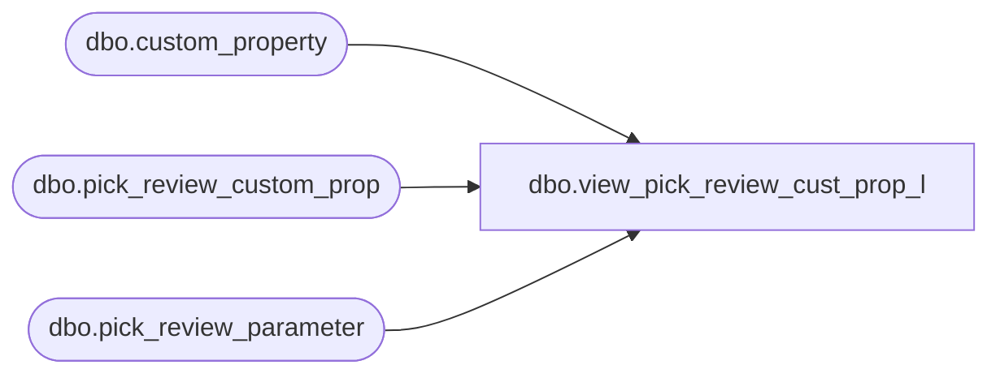

# dbo.view_pick_review_cust_prop_l

**Database:** me_01  
**Server:** bedrockdb02  

## Architecture Diagram



## Table Dependencies

| Referenced Table |
|---|
| dbo.custom_property |
| dbo.pick_review_custom_prop |
| dbo.pick_review_parameter |

## View Code

```sql
create view dbo.view_pick_review_cust_prop_l AS
 SELECT DISTINCT prp.pick_review_parameter_id,  
		     prp.merchandise_hierarchy_group_id,
                     prp.style_id,
                     prp.warehouse_id,
                     pcp.custom_property_id,
                     pcp.custom_property_value,
                     cp.cust_prop_code,
                     cp.cust_prop_label                 
 FROM pick_review_parameter prp
 LEFT OUTER JOIN pick_review_custom_prop pcp
  ON (prp.pick_review_parameter_id =pcp.pick_review_parameter_id 
      and (isnull(prp.merchandise_hierarchy_group_id,-1) = isnull(pcp.merchandise_hierarchy_group_id,-1))
      and (isnull(prp.style_id,-1) =isnull(pcp.style_id,-1))
      and prp.warehouse_id = pcp.warehouse_id)
LEFT OUTER JOIN  custom_property cp
 ON (pcp.custom_property_id = cp.custom_property_id)
```

