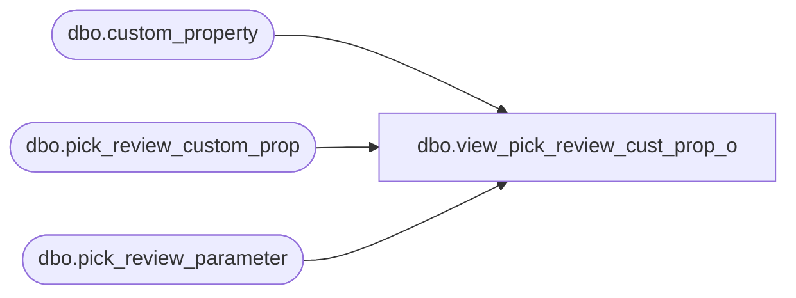

# dbo.view_pick_review_cust_prop_o

**Database:** me_01  
**Server:** bedrockdb02  

## Architecture Diagram



## Table Dependencies

| Referenced Table |
|---|
| dbo.custom_property |
| dbo.pick_review_custom_prop |
| dbo.pick_review_parameter |

## View Code

```sql
create view dbo.view_pick_review_cust_prop_o  AS
SELECT  g.pick_review_parameter_id,g.merchandise_hierarchy_group_id,g.style_id,
g.warehouse_id,{fn IFNULL(g.custom_property_id ,-1)} custom_property_id,
p.custom_property_value,p.cust_prop_code,p.cust_prop_label
from
       (SELECT DISTINCT  pr.pick_review_parameter_id,
           pr.merchandise_hierarchy_group_id,pr.style_id, pr.warehouse_id,pc.custom_property_id,
           pc.custom_property_value,c.cust_prop_code,c.cust_prop_label
           from  pick_review_custom_prop pc
        RIGHT JOIN  pick_review_parameter pr
        ON
        pr.pick_review_parameter_id = pc.pick_review_parameter_id
        and isnull(pr.merchandise_hierarchy_group_id,-1) =isnull(pc.merchandise_hierarchy_group_id,-1)
        and isnull(pr.style_id,-1) = isnull(pc.style_id,-1)
        and pr.warehouse_id = pc.warehouse_id
       LEFT JOIN custom_property c
       ON
       pc.custom_property_id = c.custom_property_id
      ) p
 RIGHT JOIN  
      (  SELECT DISTINCT a.pick_review_parameter_id,
                         a.merchandise_hierarchy_group_id, 
                         a.style_id,    
                         a.warehouse_id, 
                         NULL custom_property_value,
                         e.custom_property_id
         FROM custom_property e ,pick_review_parameter a
         WHERE e.entity_type=229 ) g
    ON
p.pick_review_parameter_id = g.pick_review_parameter_id
and isnull(p.merchandise_hierarchy_group_id,-1) = isnull(g.merchandise_hierarchy_group_id,-1)
and isnull (p.style_id,-1) = isnull(g.style_id,-1)
and p.warehouse_id = g.warehouse_id
and(p.custom_property_id = g.custom_property_id 
       OR    p.custom_property_id is NULL)
```

