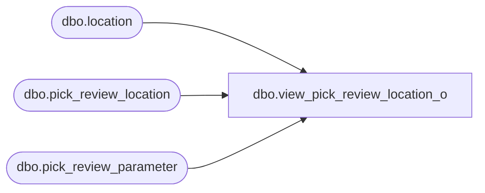

# dbo.view_pick_review_location_o

**Database:** me_01  
**Server:** bedrockdb02  

## Architecture Diagram



## Table Dependencies

| Referenced Table |
|---|
| dbo.location |
| dbo.pick_review_location |
| dbo.pick_review_parameter |

## View Code

```sql
create view dbo.view_pick_review_location_o AS
select distinct pr.pick_review_parameter_id,pr.merchandise_hierarchy_group_id,pr.style_id,
 pr.warehouse_id,pl.location_id,pl.suspend_distribution,pl.suspend_distribution_to,pl.suspend_distribution_from, pl.effective_inventory_time_frame,l.location_code,l.location_name,l.location_short_name
from pick_review_location pl
RIGHT join pick_review_parameter pr
on pr.pick_review_parameter_id = pl.pick_review_parameter_id
and isnull(pr.merchandise_hierarchy_group_id,-1) =isnull(pl.merchandise_hierarchy_group_id,-1)
and isnull(pr.style_id,-1) = isnull(pl.style_id,-1)
and pr.warehouse_id =pl.warehouse_id
LEFT join location l
on pl.location_id = l.location_id
```

