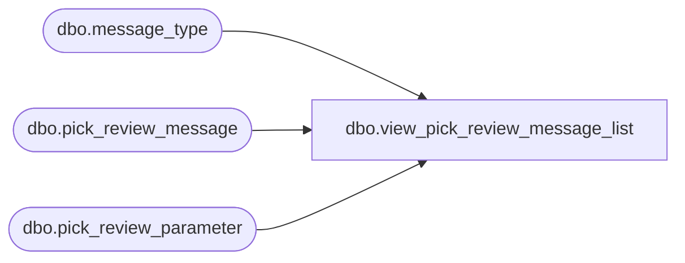

# dbo.view_pick_review_message_list

**Database:** me_01  
**Server:** bedrockdb02  

## Architecture Diagram



## Table Dependencies

| Referenced Table |
|---|
| dbo.message_type |
| dbo.pick_review_message |
| dbo.pick_review_parameter |

## View Code

```sql
create view dbo.view_pick_review_message_list AS
 SELECT DISTINCT prp.pick_review_parameter_id,  
		     prp.merchandise_hierarchy_group_id,
                     prp.style_id,
                     prp.warehouse_id,
                     pm.message_type_id, 
                     pm.message_text,
                     m.message_type_description               
 FROM pick_review_parameter prp
 LEFT OUTER JOIN pick_review_message pm
  ON (prp.pick_review_parameter_id =pm.pick_review_parameter_id 
      and (isnull(prp.merchandise_hierarchy_group_id,-1) = isnull(pm.merchandise_hierarchy_group_id,-1))
      and (isnull(prp.style_id,-1) =isnull(pm.style_id,-1))
      and prp.warehouse_id = pm.warehouse_id)
LEFT OUTER JOIN  message_type m
 ON (pm.message_type_id = m.message_type_id)
```

