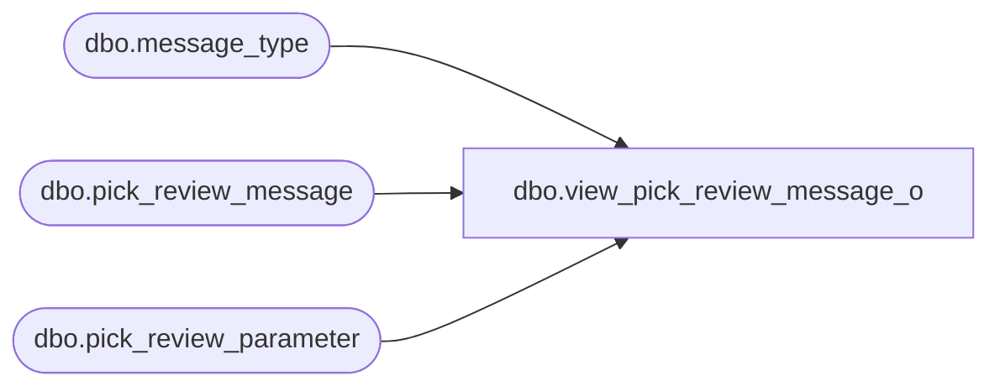

# dbo.view_pick_review_message_o

**Database:** me_01  
**Server:** bedrockdb02  

## Architecture Diagram



## Table Dependencies

| Referenced Table |
|---|
| dbo.message_type |
| dbo.pick_review_message |
| dbo.pick_review_parameter |

## View Code

```sql
create view dbo.view_pick_review_message_o AS
SELECT  g.pick_review_parameter_id,g.merchandise_hierarchy_group_id,g.style_id,
g.warehouse_id,{fn IFNULL(g.message_type_id ,-1)} message_type_id,
p.message_text,p.message_type_description
from
       (SELECT DISTINCT  pr.pick_review_parameter_id,
           pr.merchandise_hierarchy_group_id,pr.style_id, pr.warehouse_id,pm.message_type_id,
pm.message_text,m.message_type_description
           from  pick_review_message pm
        RIGHT JOIN  pick_review_parameter pr
        ON
        pr.pick_review_parameter_id = pm.pick_review_parameter_id
        and isnull(pr.merchandise_hierarchy_group_id,-1) =isnull(pm.merchandise_hierarchy_group_id,-1)
        and isnull(pr.style_id,-1) = isnull(pm.style_id,-1)
        and pr.warehouse_id = pm.warehouse_id
       LEFT JOIN message_type m
       ON
       pm.message_type_id = m.message_type_id
      ) p
 RIGHT JOIN  
      (  SELECT DISTINCT a.pick_review_parameter_id,
                         a.merchandise_hierarchy_group_id, 
                         a.style_id,    
                         a.warehouse_id, 
                         NULL message_text,
                         e.message_type_id
         FROM message_type e ,pick_review_parameter a
         WHERE e.transaction_type=6 ) g
    ON
p.pick_review_parameter_id = g.pick_review_parameter_id
and isnull(p.merchandise_hierarchy_group_id,-1) = isnull(g.merchandise_hierarchy_group_id,-1)
and isnull (p.style_id,-1) = isnull(g.style_id,-1)
and p.warehouse_id = g.warehouse_id
and(p.message_type_id = g.message_type_id 
       OR    p.message_type_id is NULL)
```

