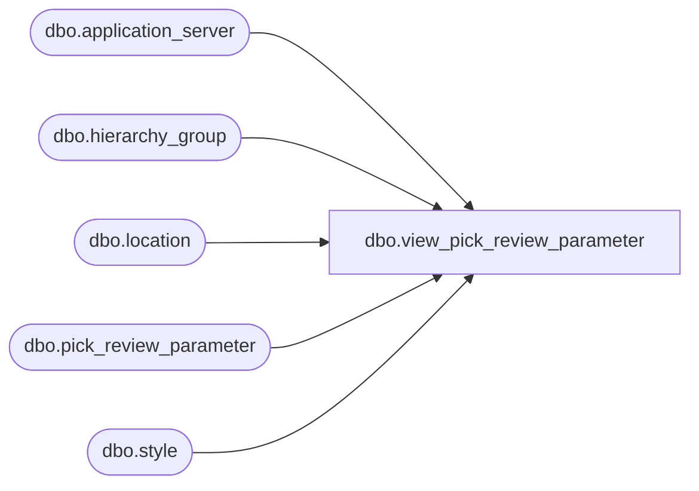

# dbo.view_pick_review_parameter

**Database:** me_01  
**Server:** bedrockdb02  

## Architecture Diagram



## Table Dependencies

| Referenced Table |
|---|
| dbo.application_server |
| dbo.hierarchy_group |
| dbo.location |
| dbo.pick_review_parameter |
| dbo.style |

## View Code

```sql
create view dbo.view_pick_review_parameter 
 AS
(SELECT DISTINCT
 pp.pick_review_parameter_id,
 NULL merchandise_hierarchy_group_id,
 NULL hierarchy_group_code,
 NULL hierarchy_group_short_label,
 NULL hierarchy_group_label,
 pp.style_id,
 s.style_code,
 s.short_desc,
 s.long_desc,
 pp.warehouse_id,
 l.location_code,
 l.location_name,
 pp.review_on_sunday,
 pp.review_on_monday,
 pp.review_on_tuesday,
 pp.review_on_wednesday,
 pp.review_on_thursday,
 pp.review_on_friday,
 pp.review_on_saturday,
 pp.cycle_frequency,
 convert(smalldatetime,convert(char(12),
 pp.last_execution,109))last_execution,
 convert(smalldatetime,convert(char(12),
 pp.next_execution,109))next_execution,
 pp.force_pick_review_date,
 pp.group_distribution_by,
 pp.distribution_description,
  pp.cycle_period,
 ap.server_name,
 pp.position_id
 FROM pick_review_parameter pp
INNER JOIN location l
ON pp.warehouse_id =l.location_id 
INNER JOIN style s
ON pp.style_id = s.style_id
 INNER JOIN application_server ap
 ON pp.application_server_id = ap.application_server_id
)
UNION ALL
(SELECT DISTINCT
 pp.pick_review_parameter_id,
 pp.merchandise_hierarchy_group_id,
 h.hierarchy_group_code,
 h.hierarchy_group_short_label,
 h.hierarchy_group_label, 
 NULL style_id,
 NULL style_code,
 NULL short_desc,
 NULL long_desc,
 pp.warehouse_id,
 l.location_code,
 l.location_name,
 pp.review_on_sunday,
 pp.review_on_monday,
 pp.review_on_tuesday,
 pp.review_on_wednesday,
 pp.review_on_thursday,
 pp.review_on_friday,
 pp.review_on_saturday,
 pp.cycle_frequency,
 convert(smalldatetime,convert(char(12),
 pp.last_execution,109))last_execution,
 convert(smalldatetime,convert(char(12),
 pp.next_execution,109)) next_execution,
 pp.force_pick_review_date,
 pp.group_distribution_by,
 pp.distribution_description,
 pp.cycle_period,
 ap.server_name,
 pp.position_id
 FROM pick_review_parameter pp
 INNER JOIN location l
 ON pp.warehouse_id =l.location_id 
 INNER JOIN hierarchy_group h
 ON pp.merchandise_hierarchy_group_id = h.hierarchy_group_id
 INNER JOIN application_server ap
 ON pp.application_server_id = ap.application_server_id
)
```

