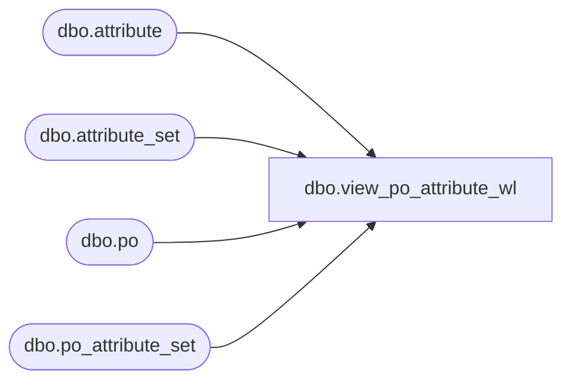

# dbo.view_po_attribute_wl

**Database:** me_01  
**Server:** bedrockdb02  

## Architecture Diagram



## Table Dependencies

| Referenced Table |
|---|
| dbo.attribute |
| dbo.attribute_set |
| dbo.po |
| dbo.po_attribute_set |

## View Code

```sql
create view dbo.view_po_attribute_wl 
AS
SELECT	DISTINCT
	po.po_id,
	pas.attribute_set_id,
	pas.attribute_id,
	ats.attribute_set_code,
	ats.attribute_set_label,
	att.attribute_code,
	att.attribute_label
FROM	po
LEFT OUTER JOIN po_attribute_set pas ON (po.po_id = pas.po_id)
LEFT OUTER JOIN attribute_set ats ON (pas.attribute_set_id = ats.attribute_set_id)
LEFT OUTER JOIN attribute att ON (pas.attribute_id = att.attribute_id)
```

