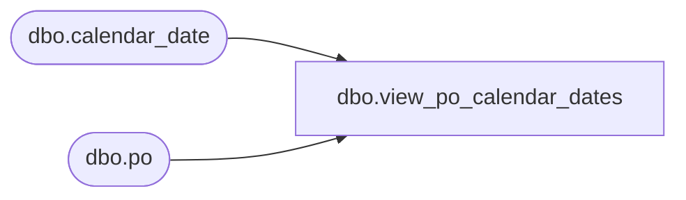

# dbo.view_po_calendar_dates

**Database:** me_01  
**Server:** bedrockdb02  

## Architecture Diagram



## Table Dependencies

| Referenced Table |
|---|
| dbo.calendar_date |
| dbo.po |

## View Code

```sql
create view dbo.view_po_calendar_dates 

AS
SELECT 	po_id, 
	cc.merch_year create_date_year, 
	cc.merch_period create_date_month, 
	cc.merch_week create_date_week, 
	oc.merch_year order_date_year, 
	oc.merch_period order_date_month, 
	oc.merch_week order_date_week,
	sc.merch_year system_cancel_date_year, 
	sc.merch_period system_cancel_date_month, 
	sc.merch_week system_cancel_date_week,
	tc.merch_year terms_as_of_year, 
	tc.merch_period terms_as_of_month, 
	tc.merch_week terms_as_of_week
FROM po
LEFT OUTER JOIN calendar_date cc ON (CONVERT(SMALLDATETIME, FLOOR(CONVERT(FLOAT, po.create_date))) = cc.calendar_date)
LEFT OUTER JOIN calendar_date oc ON (CONVERT(SMALLDATETIME, FLOOR(CONVERT(FLOAT, po.order_date))) = oc.calendar_date)
LEFT OUTER JOIN calendar_date sc ON (CONVERT(SMALLDATETIME, FLOOR(CONVERT(FLOAT, po.system_cancel_date))) = sc.calendar_date)
LEFT OUTER JOIN calendar_date tc ON (CONVERT(SMALLDATETIME, FLOOR(CONVERT(FLOAT, po.terms_as_of))) = tc.calendar_date)
```

