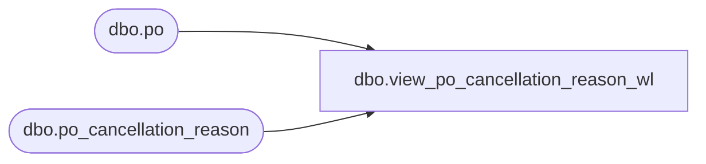

# dbo.view_po_cancellation_reason_wl

**Database:** me_01  
**Server:** bedrockdb02  

## Architecture Diagram



## Table Dependencies

| Referenced Table |
|---|
| dbo.po |
| dbo.po_cancellation_reason |

## View Code

```sql
create view dbo.view_po_cancellation_reason_wl 

AS
SELECT	DISTINCT
	p.po_id, 
	r.po_cancellation_reason_id, 
	r.reason_code,
	r.description
FROM po p
LEFT OUTER JOIN po_cancellation_reason r on (p.po_cancellation_reason_id = r.po_cancellation_reason_id)
```

