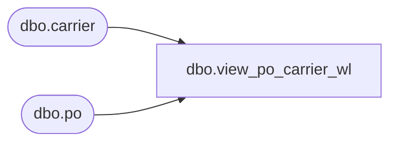

# dbo.view_po_carrier_wl

**Database:** me_01  
**Server:** bedrockdb02  

## Architecture Diagram



## Table Dependencies

| Referenced Table |
|---|
| dbo.carrier |
| dbo.po |

## View Code

```sql
create view dbo.view_po_carrier_wl 

AS
SELECT	DISTINCT
	p.po_id, 
	c.carrier_id, 
	c.carrier_code,
	c.carrier_name
FROM	po p
LEFT OUTER JOIN carrier c ON (p.carrier_id = c.carrier_id)
```

