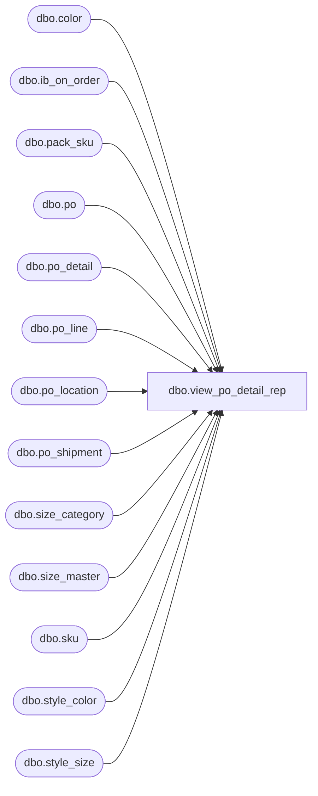

# dbo.view_po_detail_rep

**Database:** me_01  
**Server:** bedrockdb02  

## Architecture Diagram



## Table Dependencies

| Referenced Table |
|---|
| dbo.color |
| dbo.ib_on_order |
| dbo.pack_sku |
| dbo.po |
| dbo.po_detail |
| dbo.po_line |
| dbo.po_location |
| dbo.po_shipment |
| dbo.size_category |
| dbo.size_master |
| dbo.sku |
| dbo.style_color |
| dbo.style_size |

## View Code

```sql
create view dbo.view_po_detail_rep 

AS
SELECT 	po.po_id,
	pl.po_line_id,
	pd.location_id,
	pd.po_shipment_id,
	pd.expected_receipt_date,
	NULL AS color_code,
	NULL AS color_short_description,
	NULL AS color_long_description,
	pd.sku_id,
	1 AS entity_type,
	pd.prim_size_label,
	pd.prim_seq_no,
	pd.sec_size_label,
	pd.sec_seq_no,
	pd.size_code,
	pd.no_size_flag,
	pd.size_category_code,
	pd.ordered_units,
	pd.received_units
FROM 	po
	LEFT OUTER JOIN po_line pl
	ON (po.po_id = pl.po_id)
	LEFT OUTER JOIN (SELECT	pd.po_id,
				pd.po_line_id,
				ploc.location_id,
				ps.po_shipment_id,
				ps.expected_receipt_date,
				pd.sku_id,
				sm.prim_size_label,
				sm.prim_seq_no,
				sm.sec_size_label,
				sm.sec_seq_no,
				sm.size_code,
				COALESCE(sm.no_size_flag, 0) AS no_size_flag,
				scc.size_category_code,
				COALESCE(SUM(CONVERT(DECIMAL(12,0), pd.ordered_units)), 0) AS ordered_units,
				COALESCE(SUM(ioo.received_units), 0) AS received_units
				FROM 	po_detail pd
					INNER JOIN po po2
					ON (pd.po_id = po2.po_id)
					INNER JOIN po_location ploc
					ON (pd.po_id          = ploc.po_id		AND
					    pd.po_location_id = ploc.po_location_id)
					INNER JOIN po_shipment ps
					ON (pd.po_id          = ps.po_id		AND
					    pd.po_shipment_id = ps.po_shipment_id)
					INNER JOIN sku
					ON (pd.sku_id         = sku.sku_id		AND
					    pd.pack_id IS NULL)
					INNER JOIN style_size ssz 
					ON (sku.style_size_id = ssz.style_size_id)
					INNER JOIN size_master sm 
					ON (ssz.size_master_id = sm.size_master_id)
					inner join size_category scc on sm.size_category_id = scc.size_category_id
					LEFT OUTER JOIN (SELECT	sku_id, 
								document_number, 
								location_id,
								ABS(SUM(CONVERT(DECIMAL(12,0), on_order_units))) AS received_units
							FROM 	ib_on_order
							WHERE 	transaction_type_code = 110 
							AND pack_id IS NULL
							GROUP BY sku_id, 
								document_number,
								location_id
							) ioo
							ON (po2.po_no        = ioo.document_number	AND
							     pd.sku_id       = ioo.sku_id		AND
							    ioo.location_id  = ploc.location_id)
					WHERE	pd.pack_id IS NULL
					GROUP BY pd.po_id, 
							pd.po_line_id,
							ploc.location_id,
							ps.po_shipment_id,
							ps.expected_receipt_date,
							pd.sku_id,
							sm.prim_size_label,
							sm.prim_seq_no,
							sm.sec_size_label,
							sm.sec_seq_no,
							sm.size_code,
							COALESCE(sm.no_size_flag, 0),
							scc.size_category_code
					) pd
	ON (po.po_id      = pd.po_id		AND
	    pl.po_id      = pd.po_id		AND
	    pl.po_line_id = pd.po_line_id)
WHERE	pl.pack_id IS NULL
AND   po.multiple_shipments_flag = 0
UNION ALL
SELECT 	po.po_id,
	pl.po_line_id,
	pd.location_id,
	pd.po_shipment_id,
	pd.expected_receipt_date,
	pd.color_code,
	pd.color_short_description,
	pd.color_long_description,
	pd.sku_id,
	2 AS entity_type,
	pd.prim_size_label,
	pd.prim_seq_no,
	pd.sec_size_label,
	pd.sec_seq_no,
	pd.size_code,
	pd.no_size_flag,
	pd.size_category_code,
	pd.ordered_units,
	pd.received_units
FROM 	po
	LEFT OUTER JOIN po_line pl
	ON (po.po_id = pl.po_id)
	LEFT OUTER JOIN (SELECT	pd.po_id,
				pd.po_line_id,
				ploc.location_id,
				ps.po_shipment_id,
				ps.expected_receipt_date,
				c.color_code,
				sc.short_desc AS color_short_description,
				sc.long_desc AS color_long_description,
                psk.sku_id,
				sm.prim_size_label,
				sm.prim_seq_no,
				sm.sec_size_label,
				sm.sec_seq_no,
				sm.size_code,
				COALESCE(sm.no_size_flag, 0) AS no_size_flag,
				scc.size_category_code,
				COALESCE(SUM(CONVERT(DECIMAL(12,0), pd.ordered_units) * psk.sku_quantity), 0) AS ordered_units,
				COALESCE(SUM(ioo.received_units), 0) AS received_units
	FROM 	po_detail pd
		INNER JOIN po po2
		ON (pd.po_id = po2.po_id)
		INNER JOIN po_location ploc
		ON (pd.po_id          = ploc.po_id		AND
		    pd.po_location_id = ploc.po_location_id)
		INNER JOIN po_shipment ps
		ON (pd.po_id          = ps.po_id		AND
		    pd.po_shipment_id = ps.po_shipment_id)
		INNER JOIN pack_sku psk
		ON (pd.pack_id = psk.pack_id)
		INNER JOIN sku
		ON (psk.sku_id = sku.sku_id)
		INNER JOIN style_size ssz 
		ON (sku.style_size_id = ssz.style_size_id)
		INNER JOIN size_master sm 
		ON (ssz.size_master_id = sm.size_master_id)
		inner join size_category scc on sm.size_category_id = scc.size_category_id
		INNER JOIN style_color sc 
		ON (sku.style_color_id = sc.style_color_id)
		INNER JOIN color c 
		ON (sc.color_id = c.color_id)
		LEFT OUTER JOIN (SELECT	sku_id, 
					document_number, 
					location_id,
					ABS(SUM(CONVERT(DECIMAL(12,0), on_order_units))) AS received_units
				FROM 	ib_on_order
				WHERE 	transaction_type_code = 110 
				AND pack_id IS NOT NULL
				GROUP BY sku_id, 
					document_number,
					location_id
				) ioo
		ON (po2.po_no        = ioo.document_number	AND
		    psk.sku_id       = ioo.sku_id		AND
		    ioo.location_id  = ploc.location_id)
		WHERE	pd.pack_id IS NOT NULL
		GROUP BY pd.po_id, 
			pd.po_line_id,
			ploc.location_id,
			ps.po_shipment_id,
			ps.expected_receipt_date,
			c.color_code,
			sc.short_desc,
			sc.long_desc,
			psk.sku_id,
            sm.prim_size_label,
			sm.prim_seq_no,
			sm.sec_size_label,
			sm.sec_seq_no,
			sm.size_code,
			sm.no_size_flag,
			scc.size_category_code
		) pd
		ON (po.po_id      = pd.po_id		AND
		    pl.po_id      = pd.po_id		AND
		    pl.po_line_id = pd.po_line_id)
WHERE	pl.pack_id IS NOT NULL
AND   po.multiple_shipments_flag = 0
UNION ALL
SELECT 	po.po_id,
	pl.po_line_id,
	pd.location_id,
	pd.po_shipment_id,
	pd.expected_receipt_date,
	NULL AS color_code,
	NULL AS color_short_description,
	NULL AS color_long_description,
	pd.sku_id,
	1 AS entity_type,
	pd.prim_size_label,
	pd.prim_seq_no,
	pd.sec_size_label,
	pd.sec_seq_no,
	pd.size_code,
	pd.no_size_flag,
	pd.size_category_code,
	pd.ordered_units,
	pd.received_units
FROM 	po
	LEFT OUTER JOIN po_line pl
	ON (po.po_id = pl.po_id)
	LEFT OUTER JOIN (SELECT	pd.po_id,
				pd.po_line_id,
				ploc.location_id,
				ps.po_shipment_id,
				ps.expected_receipt_date,
				pd.sku_id,
				sm.prim_size_label,
				sm.prim_seq_no,
				sm.sec_size_label,
				sm.sec_seq_no,
				sm.size_code,
				COALESCE(sm.no_size_flag, 0) AS no_size_flag,
                scc.size_category_code,
				COALESCE(SUM(CONVERT(DECIMAL(12,0), pd.ordered_units)), 0) AS ordered_units,
				COALESCE(SUM(ioo.received_units), 0) AS received_units
				FROM 	po_detail pd
					INNER JOIN po po2
					ON (pd.po_id = po2.po_id)
					INNER JOIN po_location ploc
					ON (pd.po_id          = ploc.po_id		AND
					    pd.po_location_id = ploc.po_location_id)
					INNER JOIN po_shipment ps
					ON (pd.po_id          = ps.po_id		AND
					    pd.po_shipment_id = ps.po_shipment_id)
					INNER JOIN sku
					ON (pd.sku_id         = sku.sku_id		AND
					    pd.pack_id IS NULL)
					INNER JOIN style_size ssz 
					ON (sku.style_size_id = ssz.style_size_id)
					INNER JOIN size_master sm 
					ON (ssz.size_master_id = sm.size_master_id)
	                inner join size_category scc on sm.size_category_id = scc.size_category_id
					LEFT OUTER JOIN (SELECT	sku_id, 
								document_number, 
								location_id,
								receipt_date,
								ABS(SUM(CONVERT(DECIMAL(12,0), on_order_units))) AS received_units
							FROM 	ib_on_order
							WHERE 	transaction_type_code = 110 
							AND pack_id IS NULL
							GROUP BY sku_id, 
								document_number,
								location_id,
								receipt_date
							) ioo
							ON (po2.po_no        = ioo.document_number	AND
							     pd.sku_id       = ioo.sku_id		AND
							    ioo.location_id  = ploc.location_id		AND
							    ioo.receipt_date = ps.expected_receipt_date)
					WHERE	pd.pack_id IS NULL
					GROUP BY pd.po_id, 
							pd.po_line_id,
							ploc.location_id,
							ps.po_shipment_id,
							ps.expected_receipt_date,
							pd.sku_id,
							sm.prim_size_label,
							sm.prim_seq_no,
							sm.sec_size_label,
							sm.sec_seq_no,
							sm.size_code,
							COALESCE(sm.no_size_flag, 0),
							scc.size_category_code
					) pd
	ON (po.po_id      = pd.po_id		AND
	    pl.po_id      = pd.po_id		AND
	    pl.po_line_id = pd.po_line_id)
WHERE	pl.pack_id IS NULL
AND   po.multiple_shipments_flag = 1
UNION ALL
SELECT 	po.po_id,
	pl.po_line_id,
	pd.location_id,
	pd.po_shipment_id,
	pd.expected_receipt_date,
	pd.color_code,
	pd.color_short_description,
	pd.color_long_description,
	pd.sku_id,
	2 AS entity_type,
	pd.prim_size_label,
	pd.prim_seq_no,
	pd.sec_size_label,
	pd.sec_seq_no,
	pd.size_code,
	pd.no_size_flag,
    pd.size_category_code,
	pd.ordered_units,
	pd.received_units
FROM 	po
	LEFT OUTER JOIN po_line pl
	ON (po.po_id = pl.po_id)
	LEFT OUTER JOIN (SELECT	pd.po_id,
				pd.po_line_id,
				ploc.location_id,
				ps.po_shipment_id,
				ps.expected_receipt_date,
				c.color_code,
				sc.short_desc AS color_short_description,
				sc.long_desc AS color_long_description,
				psk.sku_id,
				sm.prim_size_label,
				sm.prim_seq_no,
				sm.sec_size_label,
				sm.sec_seq_no,
				sm.size_code,
				COALESCE(sm.no_size_flag, 0) AS no_size_flag,
                scc.size_category_code,
				COALESCE(SUM(CONVERT(DECIMAL(12,0), pd.ordered_units) * psk.sku_quantity), 0) AS ordered_units,
				COALESCE(SUM(ioo.received_units), 0) AS received_units
	FROM 	po_detail pd
		INNER JOIN po po2
		ON (pd.po_id = po2.po_id)
		INNER JOIN po_location ploc
		ON (pd.po_id          = ploc.po_id		AND
		    pd.po_location_id = ploc.po_location_id)
		INNER JOIN po_shipment ps
		ON (pd.po_id          = ps.po_id		AND
		    pd.po_shipment_id = ps.po_shipment_id)
		INNER JOIN pack_sku psk
		ON (pd.pack_id = psk.pack_id)
		INNER JOIN sku
		ON (psk.sku_id = sku.sku_id)
		INNER JOIN style_size ssz 
		ON (sku.style_size_id = ssz.style_size_id)
		INNER JOIN size_master sm 
		ON (ssz.size_master_id = sm.size_master_id)
		inner join size_category scc on sm.size_category_id = scc.size_category_id
		INNER JOIN style_color sc 
		ON (sku.style_color_id = sc.style_color_id)
		INNER JOIN color c 
		ON (sc.color_id = c.color_id)
		LEFT OUTER JOIN (SELECT	sku_id, 
					document_number, 
					location_id,
					receipt_date,
					ABS(SUM(CONVERT(DECIMAL(12,0), on_order_units))) AS received_units
				FROM 	ib_on_order
				WHERE 	transaction_type_code = 110 
				AND pack_id IS NOT NULL
				GROUP BY sku_id, 
					document_number,
					location_id,
					receipt_date
				) ioo
		ON (po2.po_no        = ioo.document_number	AND
		    psk.sku_id       = ioo.sku_id		AND
		    ioo.location_id  = ploc.location_id		AND
		    ioo.receipt_date = ps.expected_receipt_date)
		WHERE	pd.pack_id IS NOT NULL
		GROUP BY pd.po_id, 
			pd.po_line_id,
			ploc.location_id,
			ps.po_shipment_id,
			ps.expected_receipt_date,
			c.color_code,
			sc.short_desc,
			sc.long_desc,
		    psk.sku_id,
			sm.prim_size_label,
			sm.prim_seq_no,
			sm.sec_size_label,
			sm.sec_seq_no,
			sm.size_code,
			sm.no_size_flag,
            scc.size_category_code
		) pd
		ON (po.po_id      = pd.po_id		AND
		    pl.po_id      = pd.po_id		AND
		    pl.po_line_id = pd.po_line_id)
WHERE	pl.pack_id IS NOT NULL
AND   po.multiple_shipments_flag = 1
```

