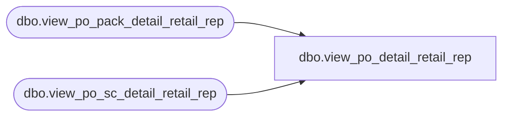

# dbo.view_po_detail_retail_rep

**Database:** me_01  
**Server:** bedrockdb02  

## Architecture Diagram



## Table Dependencies

| Referenced Table |
|---|
| dbo.view_po_pack_detail_retail_rep |
| dbo.view_po_sc_detail_retail_rep |

## View Code

```sql
create view dbo.view_po_detail_retail_rep 


AS
SELECT 	pd.po_id,
		pd.po_detail_id,
		SUM(unit_retail) AS unit_retail
FROM	(
			SELECT	vpr.po_id,
					vpr.po_detail_id,		
					CONVERT(NUMERIC(14, 2), vpr.unit_retail) AS unit_retail
			FROM	view_po_sc_detail_retail_rep vpr
			UNION ALL
			SELECT	vpr.po_id,
					vpr.po_detail_id,		
					CONVERT(NUMERIC(14, 2), vpr.unit_retail) AS unit_retail
			FROM	view_po_pack_detail_retail_rep vpr
		) pd
GROUP BY pd.po_id,
		pd.po_detail_id
```

