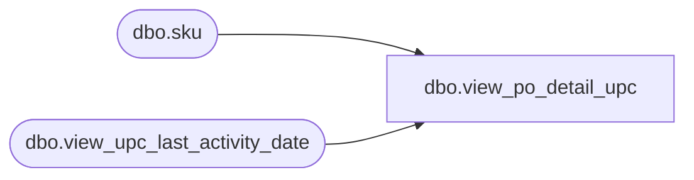

# dbo.view_po_detail_upc

**Database:** me_01  
**Server:** bedrockdb02  

## Architecture Diagram



## Table Dependencies

| Referenced Table |
|---|
| dbo.sku |
| dbo.view_upc_last_activity_date |

## View Code

```sql
CREATE VIEW dbo.view_po_detail_upc 
AS
SELECT  sku.sku_id,
        ul.upc_number,
        ul.upc_type,
        ul.last_activity_date
FROM    sku
        LEFT OUTER JOIN view_upc_last_activity_date ul
        ON (sku.sku_id = ul.sku_id)
```

