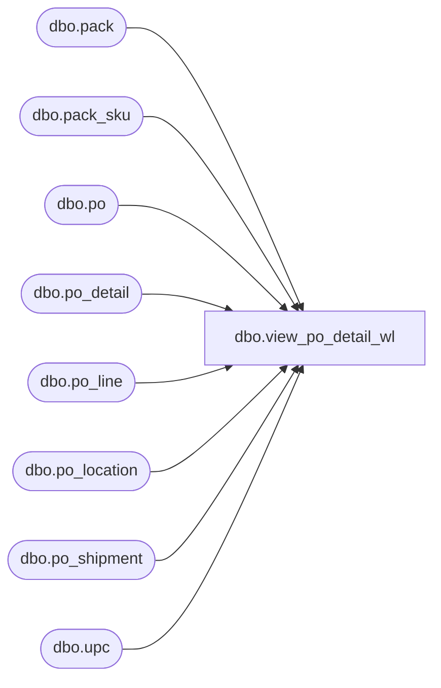

# dbo.view_po_detail_wl

**Database:** me_01  
**Server:** bedrockdb02  

## Architecture Diagram



## Table Dependencies

| Referenced Table |
|---|
| dbo.pack |
| dbo.pack_sku |
| dbo.po |
| dbo.po_detail |
| dbo.po_line |
| dbo.po_location |
| dbo.po_shipment |
| dbo.upc |

## View Code

```sql
create view dbo.view_po_detail_wl 

AS
SELECT 	DISTINCT
		po.po_id,
		COALESCE(pl.po_line_id, 0) AS po_line_id,
		COALESCE(ps.po_shipment_id, 0) AS po_shipment_id,
		COALESCE(ploc.po_location_id, 0) AS po_location_id,
		u.upc_id,
		u.upc_number,
		u.upc_type
FROM	po
		LEFT OUTER JOIN po_line pl ON (po.po_id = pl.po_id)
		LEFT OUTER JOIN po_shipment ps ON (po.po_id = ps.po_id)
		LEFT OUTER JOIN po_location ploc ON (po.po_id = ploc.po_id)
		LEFT OUTER JOIN po_detail pd ON (pd.po_id = po.po_id AND pd.po_line_id = pl.po_line_id AND pd.po_shipment_id = ps.po_shipment_id AND pd.po_location_id = ploc.po_location_id)
		LEFT OUTER JOIN upc u ON (pd.sku_id = u.sku_id)
WHERE 	pd.sku_id IS NOT NULL 
		OR pl.po_line_id IS NULL 
		OR ps.po_shipment_id IS NULL
		OR ploc.po_location_id IS NULL 
		OR pd.po_detail_id IS NULL
UNION
SELECT 	DISTINCT
		po.po_id,
		COALESCE(pl.po_line_id, 0) AS po_line_id,
		COALESCE(ps.po_shipment_id, 0) AS po_shipment_id,
		COALESCE(ploc.po_location_id, 0) AS po_location_id,
		upcs.upc_id,
		upcs.upc_number,
		upcs.upc_type
FROM	po
		LEFT OUTER JOIN po_line pl
		ON (po.po_id = pl.po_id)
		LEFT OUTER JOIN po_shipment ps
		ON (po.po_id = ps.po_id)
		LEFT OUTER JOIN po_location ploc
		ON (po.po_id = ploc.po_id)
		LEFT OUTER JOIN po_detail pd
 		ON (pd.po_id = po.po_id AND pd.po_line_id = pl.po_line_id AND pd.po_shipment_id = ps.po_shipment_id AND pd.po_location_id = ploc.po_location_id)
		LEFT OUTER JOIN (SELECT p.pack_id, 
								u.upc_id, 
								u.upc_number,
								u.upc_type
						FROM	pack p
								INNER JOIN upc u
								ON (p.pack_id = u.pack_id)
						UNION
						SELECT	p.pack_id, 
								u.upc_id, 
								u.upc_number,
								u.upc_type
						FROM	pack p
								INNER JOIN pack_sku ps
								ON (p.pack_id = ps.pack_id)
								INNER JOIN upc u
								ON (ps.sku_id = u.sku_id)) upcs
		ON (pd.pack_id = upcs.pack_id)
WHERE 	pd.pack_id IS NOT NULL
```

