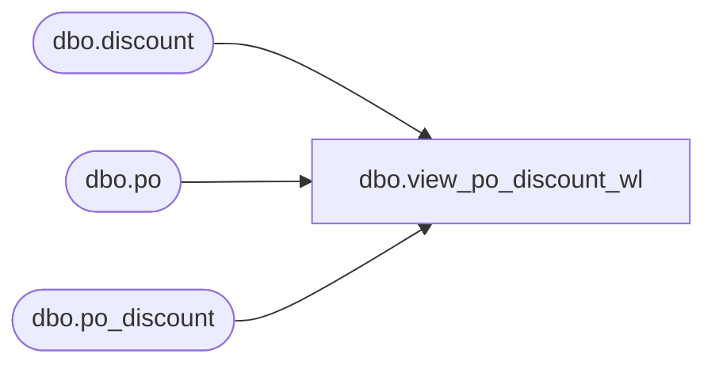

# dbo.view_po_discount_wl

**Database:** me_01  
**Server:** bedrockdb02  

## Architecture Diagram



## Table Dependencies

| Referenced Table |
|---|
| dbo.discount |
| dbo.po |
| dbo.po_discount |

## View Code

```sql
create view dbo.view_po_discount_wl 
AS
SELECT	DISTINCT
	po.po_id, 
	pd.discount_id,
	d.discount_code,
	d.discount_description,
	pd.pct_amt,
	pd.discount_value,
	pd.calculate_on,
	ISNULL(pd.reflect_in_discount_cost_flag, 0) 'reflect_in_discount_cost_flag',
	ISNULL(pd.subject_to_terms_flag, 0) 'subject_to_terms_flag',
	pd.sequence,
	ISNULL(d.reflect_in_net_cost_flag, 0) 'reflect_in_net_cost_flag'
FROM	po
LEFT OUTER JOIN po_discount pd ON (po.po_id = pd.po_id)
LEFT OUTER JOIN discount d ON (pd.discount_id = d.discount_id)
```

