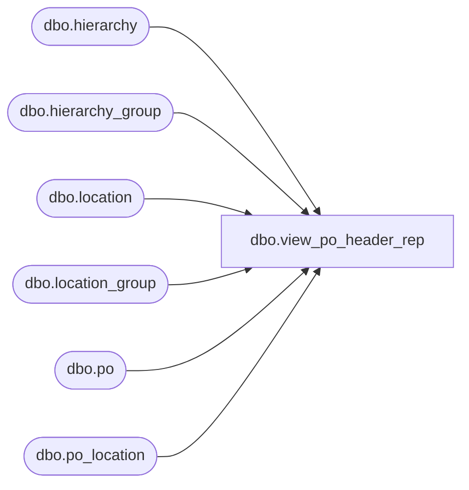

# dbo.view_po_header_rep

**Database:** me_01  
**Server:** bedrockdb02  

## Architecture Diagram



## Table Dependencies

| Referenced Table |
|---|
| dbo.hierarchy |
| dbo.hierarchy_group |
| dbo.location |
| dbo.location_group |
| dbo.po |
| dbo.po_location |

## View Code

```sql
create view dbo.view_po_header_rep 

AS
SELECT	po.po_id,
		po.vendor_id,
		po.print_flag,
		po.edi_flag,
		po.import_order_flag,
		po.special_order_flag,
		po.multiple_shipments_flag,
		po.cancellation_exemption_flag,
		po.allocation_completed_flag,
		po.new_store_flag,
		po.updatestamp,
		po.ticket_source,
		po.ticket_status,
		po.gen_tkts_frm_warehouse,
		po.last_modified,
		po.position_id,
		po.ship_via_id,
		po.fob_description,
		po.country_id,
		po.currency_id,
		po.terms_id,
		po.po_no,
		po.po_description,
		po.po_type,
		po.predistribution_type,
		po.create_date,
		po.system_cancel_date,
		po.order_date,
		po.terms_as_of,
		po.po_discount_last_modified,
		po.exchange_rate,
		po.po_status,
		po.approval_status,
		po.blanket_po_number,
		po.release_number,
		po.approval_category,
		po.carrier_id,
		po.number_of_releases,
		po.printed_status,
		po.edi_status,
		po.cancellation_reason,
		po.source,
		po.external_system_name,
		po.external_document_no,
		po.reference_po_no,
		po.po_cancellation_reason_id,
		po.agent,
		po.consolidator,
		po.actual_cancel_date,
		po.reinstated_flag,
		po.from_delivery_date,
		po.to_delivery_date,
		po.storepack_defns_ready_flag,
		l.location_id,
		l.location_code,
		l.location_name,
		l.location_type,
		hg.hierarchy_group_code,
		hg.hierarchy_group_label
FROM 	po
		LEFT OUTER JOIN (po_location ploc
						INNER JOIN location l
						ON (ploc.location_id = l.location_id)
						INNER JOIN location_group lg 
						ON (lg.location_id = l.location_id)
						INNER JOIN hierarchy_group hg 
						ON (lg.hierarchy_group_id = hg.hierarchy_group_id)
						INNER JOIN hierarchy h 
						ON (hg.hierarchy_id = h.hierarchy_id AND h.alternate_flag = 0)
						)
		ON (ploc.po_id = po.po_id
			AND (po.predistribution_type = 1 OR po.predistribution_type = 2 OR po.predistribution_type = 3))
```

