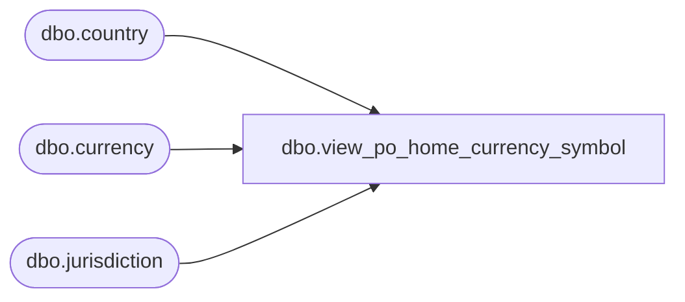

# dbo.view_po_home_currency_symbol

**Database:** me_01  
**Server:** bedrockdb02  

## Architecture Diagram



## Table Dependencies

| Referenced Table |
|---|
| dbo.country |
| dbo.currency |
| dbo.jurisdiction |

## View Code

```sql
create view dbo.view_po_home_currency_symbol 


AS
SELECT cc.currency_symbol
FROM   jurisdiction j
	   INNER JOIN country c
	   ON (j.country_id = c.country_id)
	   INNER JOIN currency cc
	   ON (c.currency_id = cc.currency_id)
WHERE  j.home_jurisdiction_flag = 1
```

