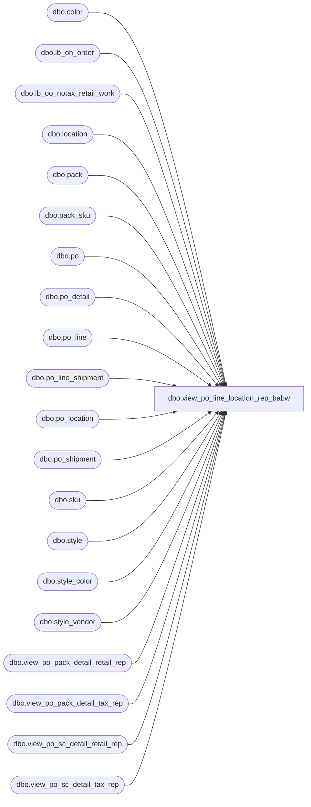

# dbo.view_po_line_location_rep_babw

**Database:** me_01  
**Server:** bedrockdb02  

## Architecture Diagram



## Table Dependencies

| Referenced Table |
|---|
| dbo.color |
| dbo.ib_on_order |
| dbo.ib_oo_notax_retail_work |
| dbo.location |
| dbo.pack |
| dbo.pack_sku |
| dbo.po |
| dbo.po_detail |
| dbo.po_line |
| dbo.po_line_shipment |
| dbo.po_location |
| dbo.po_shipment |
| dbo.sku |
| dbo.style |
| dbo.style_color |
| dbo.style_vendor |
| dbo.view_po_pack_detail_retail_rep |
| dbo.view_po_pack_detail_tax_rep |
| dbo.view_po_sc_detail_retail_rep |
| dbo.view_po_sc_detail_tax_rep |

## View Code

```sql
CREATE view [dbo].[view_po_line_location_rep_babw]

AS

/*
View name: view_po_line_location_rep_babw

Description: 

HISTORY (available through VC_UTIL prior to this date):
Date       			Name         		Def#			Desc
Mar 1, 2010			Sameer Patel		116228			ret:mew:pom:views view_po_line_location_rep does not check for po re-instate so 0 appears in total
Nov. 10, 2010		Feng Li				122483			pom reports view: cannot see all pos for a vendor. cancelled pos do not appear
                                                                                (port of defect 122483)
Dec. 4, 2010		Ivan Dimitrov		123320			Added po_no for performance improvements in POM reports
Dec. 8, 2010		Ivan Dimitrov		123320			Combined two main unions for performance improvements
Apr.13, 2011		Sameer Patel		125850			ordered retail displaying incorrectly in view_po_line_location_rep
July 18, 2011		Feng Li				128516			duplicate lines are printed on po when expected receipt date is changed
July 6, 2015 Geoff Syme testing duplicate entries for po shipments
*/


SELECT 	po.po_no,
		po.po_id,
		COALESCE(pl.po_line_id, 0) AS po_line_id,
		pl.line_no,
		pl.store_pack_flag,
		ploc.location_id,
		loc.location_code,
		loc.location_name,
		pd.expected_receipt_date,
		COALESCE(s.style_id, s2.style_id) AS style_id,
		COALESCE(s.style_code, s2.style_code) as style_code,
		COALESCE(s.long_desc, s2.long_desc) as long_desc,
		COALESCE(s.short_desc, s2.short_desc) as short_desc,
		COALESCE(sv.vendor_style, sv2.vendor_style) as vendor_style,
		p.pack_code,
		p.pack_description,
		p.pack_short_description,
		p.vendor_pack_code, 
		c.color_code,
		sc.style_color_id,
		sc.long_desc AS color_long_description,
		sc.short_desc AS color_short_description,
		COALESCE(s.distribution_multiple, s2.distribution_multiple) AS distribution_multiple, 
		COALESCE(s.order_multiple, s2.order_multiple) AS order_multiple,
        	pl.first_cost,
		pl.net_final_cost,
		pl.net_cost,
		COALESCE(cast (round (SUM(pd.ordered_units/psk.sku_quantity ),0) as int) , 0) as total_line_loc_pack_ord_units,  
		COALESCE(SUM(pd.ordered_units), 0) AS total_line_loc_ordered_units,
		COALESCE(SUM(pd.received_units), 0) AS total_line_loc_received_units,
		COALESCE(SUM(ordered_cost),SUM(pd.ordered_units * pl.net_final_cost), 0) AS total_line_loc_ordered_cost,
		COALESCE(SUM(pd.received_cost), 0) AS total_line_loc_received_cost,
		COALESCE(SUM(pd.ordered_retail), 0) AS total_line_loc_ordered_retail,
		COALESCE(SUM(pd.ordered_retail_notx), SUM(pd.ordered_retail), 0) AS total_line_loc_ord_retail_notx,
		COALESCE(SUM(pd.received_retail), 0) AS total_line_loc_received_retail,
		COALESCE(SUM(pd.received_retail_notx), SUM(pd.received_retail) , 0) AS total_line_loc_rec_retail_notx,
		pd.entity_type
FROM 	po 
		LEFT OUTER JOIN po_line pl 
		ON (po.po_id = pl.po_id)
		LEFT OUTER JOIN (po_location ploc
						INNER JOIN location loc
						ON (ploc.location_id = loc.location_id)
						)
		ON (po.po_id = ploc.po_id)
		LEFT OUTER JOIN style_color sc 
		ON (sc.style_color_id = pl.style_color_id)
		LEFT OUTER JOIN style s 
		ON (sc.style_id = s.style_id)
		LEFT OUTER JOIN color c 
		ON (sc.color_id = c.color_id)
		LEFT OUTER JOIN style_vendor sv 
		ON (s.style_id = sv.style_id 
			AND sv.vendor_id = po.vendor_id)
		-- packs stuff
		LEFT OUTER JOIN pack p 
		ON (p.pack_id = pl.pack_id)
		LEFT OUTER JOIN (SELECT	pack_id, 
								SUM(sku_quantity) AS sku_quantity 
						FROM 	pack_sku 
						GROUP BY pack_id
						) psk
		ON (pl.pack_id = psk.pack_id)
		LEFT OUTER JOIN style s2 
		ON (p.style_id = s2.style_id)
		LEFT OUTER JOIN style_vendor sv2
		ON (s2.style_id = sv2.style_id 
			AND sv2.vendor_id = po.vendor_id)
		-- end packs
LEFT OUTER JOIN (	
	-- received from ioo
						SELECT	poi.po_id,
								pli.po_line_id,
								ploci.po_location_id,
								i.sku_id,  
								i.pack_id,
								ps.expected_receipt_date,
								0 as ordered_units,
								0 as ordered_retail,
								0 as ordered_cost,
								0 as ordered_retail_notx,
								ABS(SUM(CONVERT(DECIMAL(12,0), on_order_units))) AS received_units, 
								ABS(SUM(CONVERT(DECIMAL(14,2), on_order_valuation_retail))) AS received_retail, 
								ABS(SUM(CONVERT(DECIMAL(14,2), on_order_cost))) AS received_cost,
								ABS(SUM(CONVERT(DECIMAL(14,2), COALESCE (valuation_retail_no_tax,on_order_valuation_retail)))) AS received_retail_notx,
								1 as entity_type
						FROM 	ib_on_order i
								INNER JOIN sku ki
								ON (i.sku_id = ki.sku_id)
								INNER JOIN po poi
								ON (i.document_number = poi.po_no)
								INNER JOIN po_line pli
								ON (poi.po_id = pli.po_id
								AND pli.style_color_id = ki.style_color_id)
								INNER JOIN po_location ploci
								ON (ploci.location_id = i.location_id
									AND ploci.po_id = poi.po_id)
								INNER JOIN po_line_shipment pls on pls.po_id = poi.po_id AND pls.po_line_id = pli.po_line_id
								INNER JOIN po_shipment ps on ps.po_id = poi.po_id AND ps.po_id = pls.po_id and ps.po_shipment_id=pls.po_shipment_id --GFS 07/06/15: added join at shipment level
								LEFT OUTER JOIN ib_oo_notax_retail_work iont
								ON (iont.ib_on_order_id = i.ib_on_order_id)
						WHERE 	transaction_type_code = 110 
								AND i.pack_id IS NULL
								AND poi.po_status > 3
						GROUP BY poi.po_id,
								pli.po_line_id,
								ploci.po_location_id,
								i.sku_id,  
								i.pack_id,
								ps.expected_receipt_date
-- on order from ioo  
						UNION ALL
						SELECT	poi.po_id,
								pli.po_line_id,
								ploci.po_location_id,
								i.sku_id,  
								i.pack_id,
								ps.expected_receipt_date,
								SUM(CONVERT(DECIMAL(12,0), on_order_units)) as ordered_units,
								SUM(CONVERT(DECIMAL(14,2), on_order_valuation_retail)) as ordered_retail,
								SUM(CONVERT(DECIMAL(14,2), on_order_cost)) as ordered_cost,
								SUM(CONVERT(DECIMAL(14,2), COALESCE (valuation_retail_no_tax,on_order_valuation_retail))) as ordered_retail_notx,
								0 AS received_units, 
								0 AS received_retail, 
								0 AS received_cost,
								0 AS received_retail_notx,
								1 as entity_type
						FROM 	ib_on_order i
								INNER JOIN sku ki
								ON (i.sku_id = ki.sku_id)
								INNER JOIN po poi
								ON (i.document_number = poi.po_no)
								INNER JOIN po_line pli
								ON (poi.po_id = pli.po_id
								AND pli.style_color_id = ki.style_color_id)
								INNER JOIN po_location ploci
								ON (ploci.location_id = i.location_id
									AND ploci.po_id = poi.po_id)
								INNER JOIN po_line_shipment pls on pls.po_id = poi.po_id AND pls.po_line_id = pli.po_line_id 
								INNER JOIN po_shipment ps on ps.po_id = poi.po_id AND ps.po_id = pls.po_id and ps.po_shipment_id=pls.po_shipment_id --GFS 07/06/15: added join at shipment level
								LEFT OUTER JOIN ib_oo_notax_retail_work iont
								ON (iont.ib_on_order_id = i.ib_on_order_id)
						WHERE 	transaction_type_code in (100,101,120,130,150)
								AND i.pack_id IS NULL
								AND poi.po_status > 3
								AND approval_status not in (5,6)
						GROUP BY poi.po_id,
								pli.po_line_id,
								ploci.po_location_id,
								i.sku_id,  
								i.pack_id,
								ps.expected_receipt_date
						--HAVING SUM(on_order_units) <> 0 defect 122483 let open-never received-cancelled po row returned
-- for preliminary POs
						UNION ALL
						SELECT pd.po_id, 
								pd.po_line_id,
								pd.po_location_id,
								pd.sku_id,
								pd.pack_id,
								ps.expected_receipt_date as expected_receipt_date,
								CONVERT(DECIMAL(12,0), pd.ordered_units) AS ordered_units,
								CONVERT(DECIMAL(14,2), pdr.unit_retail*pd.ordered_units) AS ordered_retail,
								NULL as ordered_cost,
								CONVERT(DECIMAL(14,2), ROUND(pdr.unit_retail * pdt.total_exclude_tax_ratio, 2)*pd.ordered_units) AS ordered_retail_notx,
								0 AS received_units, 
								0 AS received_retail, 
								0 AS received_cost,
								0 AS received_retail_notx,
								1 as entity_type
						FROM 	po_detail pd
								INNER JOIN po_shipment ps
								ON (pd.po_id = ps.po_id
									AND pd.po_shipment_id = ps.po_shipment_id)
								INNER JOIN view_po_sc_detail_retail_rep pdr 
								ON (pd.po_id = pdr.po_id 
									AND pd.po_detail_id = pdr.po_detail_id)
								INNER JOIN view_po_sc_detail_tax_rep pdt  
								ON (pd.po_id = pdt.po_id  
								   AND pd.po_detail_id = pdt.po_detail_id)
								INNER JOIN po popd
								ON (pd.po_id = popd.po_id)
						WHERE	pd.pack_id IS NULL
								AND (po_status <=3 OR approval_status in (5,6))

						UNION ALL -- for packs
	-- received from ioo packs
						SELECT	poi.po_id,
								pli.po_line_id,
								ploci.po_location_id,
								i.sku_id,  
								i.pack_id,
								ps.expected_receipt_date,
								0 as ordered_units,
								0 as ordered_retail,
								0 as ordered_cost,
								0 as ordered_retail_notx,
								ABS(SUM(CONVERT(DECIMAL(12,0), on_order_units))) AS received_units, 
								ABS(SUM(CONVERT(DECIMAL(14,2), on_order_valuation_retail))) AS received_retail, 
								ABS(SUM(CONVERT(DECIMAL(14,2), on_order_cost))) AS received_cost,
								ABS(SUM(CONVERT(DECIMAL(14,2), valuation_retail_no_tax))) AS received_retail_notx,
								2 as entity_type
						FROM 	ib_on_order i
								INNER JOIN pack ki
								ON (i.pack_id = ki.pack_id)
								INNER JOIN po poi
								ON (i.document_number = poi.po_no)
								INNER JOIN po_line pli
								ON (poi.po_id = pli.po_id
								AND pli.pack_id = ki.pack_id)
								INNER JOIN po_location ploci
								ON (ploci.location_id = i.location_id
									AND ploci.po_id = poi.po_id)
								INNER JOIN po_line_shipment pls on pls.po_id = poi.po_id AND pls.po_line_id = pli.po_line_id
								INNER JOIN po_shipment ps on ps.po_id = poi.po_id AND ps.po_id = pls.po_id and ps.po_shipment_id=pls.po_shipment_id --GFS 07/06/15: added join at shipment level
								LEFT OUTER JOIN ib_oo_notax_retail_work iont
								ON (iont.ib_on_order_id = i.ib_on_order_id)
						WHERE 	transaction_type_code = 110 
								AND i.pack_id IS NOT NULL
								AND poi.po_status > 3
						GROUP BY poi.po_id,
								pli.po_line_id,
								ploci.po_location_id,
								i.sku_id,  
								i.pack_id,
								ps.expected_receipt_date
-- on order from ioo  packs
						UNION ALL
						SELECT	poi.po_id,
								pli.po_line_id,
								ploci.po_location_id,
								i.sku_id,  
								i.pack_id,
								ps.expected_receipt_date,
								SUM(CONVERT(DECIMAL(12,0), on_order_units)) as ordered_units,
								SUM(CONVERT(DECIMAL(14,2), on_order_valuation_retail)) as ordered_retail,
								SUM(CONVERT(DECIMAL(14,2), on_order_cost)) as ordered_cost,
								SUM(CONVERT(DECIMAL(14,2), valuation_retail_no_tax)) as ordered_retail_notx,
								0 AS received_units, 
								0 AS received_retail, 
								0 AS received_cost,
								0 AS received_retail_notx,
								2 as entity_type
						FROM 	ib_on_order i
								INNER JOIN pack ki
								ON (i.pack_id = ki.pack_id)
								INNER JOIN po poi
								ON (i.document_number = poi.po_no)
								INNER JOIN po_line pli
								ON (poi.po_id = pli.po_id
								AND pli.pack_id = ki.pack_id)
								INNER JOIN po_location ploci
								ON (ploci.location_id = i.location_id
									AND ploci.po_id = poi.po_id)
								INNER JOIN po_line_shipment pls on pls.po_id = poi.po_id AND pls.po_line_id = pli.po_line_id
								INNER JOIN po_shipment ps on ps.po_id = poi.po_id AND ps.po_id = pls.po_id and ps.po_shipment_id=pls.po_shipment_id --GFS 07/06/15: added join at shipment level
								LEFT OUTER JOIN ib_oo_notax_retail_work iont
								ON (iont.ib_on_order_id = i.ib_on_order_id)
						WHERE 	transaction_type_code in (100,101,120,130,150)
								AND i.pack_id IS NOT NULL
								AND poi.po_status > 3
								AND approval_status not in (5,6)
						GROUP BY poi.po_id,
								pli.po_line_id,
								ploci.po_location_id,
								i.sku_id,  
								i.pack_id,
								ps.expected_receipt_date
						-- HAVING SUM(on_order_units) <> 0
-- for preliminary POs packs
						UNION ALL
						SELECT pd.po_id, 
								pd.po_line_id,
								pd.po_location_id,
								pd.sku_id,
								pd.pack_id,
								ps.expected_receipt_date as expected_receipt_date,
								CONVERT(DECIMAL(12,0), pd.ordered_units*sku_quantity) AS ordered_units,
								CONVERT(DECIMAL(14,2), pdr.unit_retail*pd.ordered_units) AS ordered_retail,
								NULL as ordered_cost,
								CONVERT(DECIMAL(14,2), ROUND(pdr.unit_retail * pdt.total_exclude_tax_ratio, 2)*pd.ordered_units) AS ordered_retail_notx,
								0 AS received_units, 
								0 AS received_retail, 
								0 AS received_cost,
								0 AS received_retail_notx,
								2 as entity_type
						FROM 	po_detail pd
								INNER JOIN po_shipment ps
								ON (pd.po_id = ps.po_id
									AND pd.po_shipment_id = ps.po_shipment_id)
								INNER JOIN (SELECT	pack_id, 
								SUM(sku_quantity) AS sku_quantity 
								FROM 	pack_sku 
								GROUP BY pack_id
								) psk
								ON (pd.pack_id = psk.pack_id)
								INNER JOIN view_po_pack_detail_retail_rep pdr 
								ON (pd.po_id = pdr.po_id 
									AND pd.po_detail_id = pdr.po_detail_id)
								INNER JOIN view_po_pack_detail_tax_rep pdt  
								ON (pd.po_id = pdt.po_id  
								   AND pd.po_detail_id = pdt.po_detail_id)
								INNER JOIN po popd
								ON (pd.po_id = popd.po_id)
						WHERE	pd.pack_id IS NOT NULL
								AND (po_status <=3 OR approval_status in (5,6))


) pd 
 ON (po.po_id = pd.po_id 
			AND pl.po_id = pd.po_id
			AND pl.po_line_id = pd.po_line_id
			AND ploc.po_id = pd.po_id
			AND ploc.po_location_id = pd.po_location_id
	)
GROUP BY po.po_no, 
		po.po_id, 
		pl.po_line_id, 
		pl.line_no,
		pl.store_pack_flag,
		pl.pack_id,
		ploc.location_id,
		loc.location_code,
		loc.location_name,
		expected_receipt_date,
		COALESCE(s.style_id, s2.style_id),
		COALESCE(s.style_code, s2.style_code),
		COALESCE(s.long_desc, s2.long_desc),
		COALESCE(s.short_desc, s2.short_desc),
		COALESCE(sv.vendor_style, sv2.vendor_style),
		c.color_code,
		sc.style_color_id, 
		sc.long_desc,
		sc.short_desc,
		COALESCE(s.distribution_multiple, s2.distribution_multiple), 
		COALESCE(s.order_multiple, s2.order_multiple) ,
		pl.first_cost,
		pl.net_final_cost,
		pl.net_cost,
		p.pack_code,
		p.pack_description,
		p.pack_short_description,
		p.vendor_pack_code,
		pd.entity_type
```

