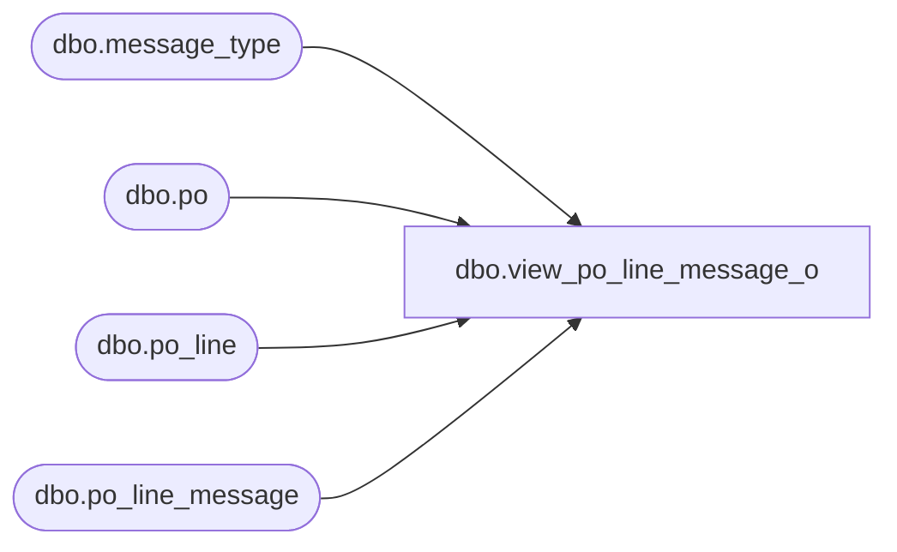

# dbo.view_po_line_message_o

**Database:** me_01  
**Server:** bedrockdb02  

## Architecture Diagram



## Table Dependencies

| Referenced Table |
|---|
| dbo.message_type |
| dbo.po |
| dbo.po_line |
| dbo.po_line_message |

## View Code

```sql
create view dbo.view_po_line_message_o 
AS
SELECT	DISTINCT
		po.po_id,
		COALESCE(pl.po_line_id, 0) AS po_line_id,
		pm.message_type_id,
		pm.message AS po_line_msg,
		mt.message_type_description AS po_line_msg_type
FROM	po
		LEFT OUTER JOIN po_line pl
		ON (po.po_id = pl.po_id)
		LEFT OUTER JOIN po_line_message pm 
		ON (pl.po_line_id = pm.po_line_id 
			AND pl.po_id = pm.po_id)
		LEFT OUTER JOIN message_type mt 
		ON (pm.message_type_id = mt.message_type_id)
```

