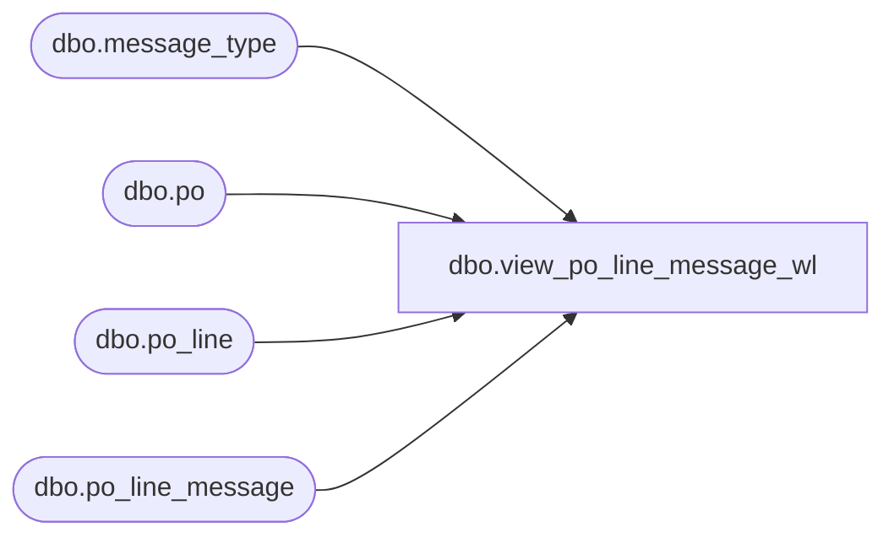

# dbo.view_po_line_message_wl

**Database:** me_01  
**Server:** bedrockdb02  

## Architecture Diagram



## Table Dependencies

| Referenced Table |
|---|
| dbo.message_type |
| dbo.po |
| dbo.po_line |
| dbo.po_line_message |

## View Code

```sql
create view dbo.view_po_line_message_wl 

AS
SELECT	DISTINCT
		po.po_id,
		COALESCE(pl.po_line_id, 0) AS po_line_id,
		pm.message_type_id,
		COALESCE(pm.message, N'') AS message,
		COALESCE(m.message_type_description, N'') AS message_type_description,
		COALESCE(m.print_message_for_vendor_flag,0) AS print_message_for_vendor_flag,
		COALESCE(m.user_defined_flag,0) AS user_defined_flag,
		COALESCE(m.edi_support_flag, 0) AS edi_support_flag
FROM	po
		LEFT OUTER JOIN po_line pl
		ON (po.po_id = pl.po_id)
		LEFT OUTER JOIN po_line_message pm 
		ON (pl.po_line_id = pm.po_line_id 
			AND pl.po_id = pm.po_id)
		LEFT OUTER JOIN message_type m 
		ON (pm.message_type_id = m.message_type_id)
```

