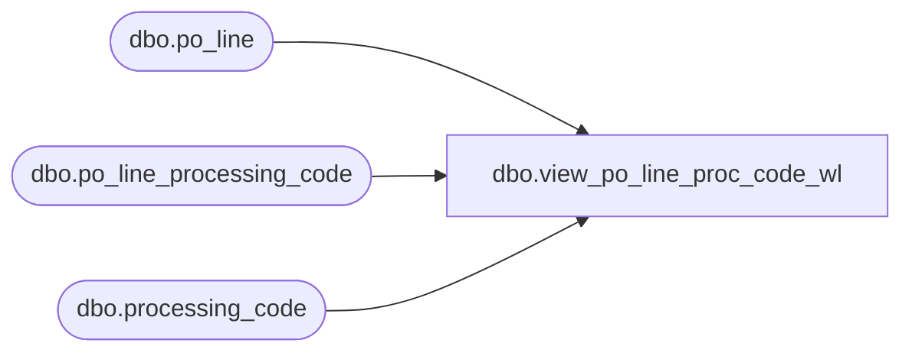

# dbo.view_po_line_proc_code_wl

**Database:** me_01  
**Server:** bedrockdb02  

## Architecture Diagram



## Table Dependencies

| Referenced Table |
|---|
| dbo.po_line |
| dbo.po_line_processing_code |
| dbo.processing_code |

## View Code

```sql
create view dbo.view_po_line_proc_code_wl 
AS
SELECT 	DISTINCT
	pl.po_id,
	pl.po_line_id,
	plpc.processing_code_id,
	pc.processing_code, 
	pc.description,
	pc.process_type,
	plpc.quantity
FROM	po_line pl
LEFT OUTER JOIN po_line_processing_code plpc ON (pl.po_line_id = plpc.po_line_id AND pl.po_id = plpc.po_id)
LEFT OUTER JOIN processing_code pc ON (pc.processing_code_id = plpc.processing_code_id)
```

