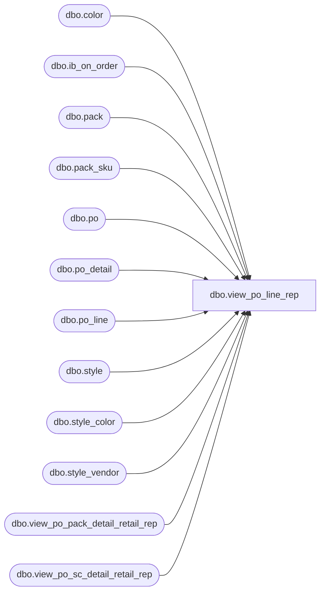

# dbo.view_po_line_rep

**Database:** me_01  
**Server:** bedrockdb02  

## Architecture Diagram



## Table Dependencies

| Referenced Table |
|---|
| dbo.color |
| dbo.ib_on_order |
| dbo.pack |
| dbo.pack_sku |
| dbo.po |
| dbo.po_detail |
| dbo.po_line |
| dbo.style |
| dbo.style_color |
| dbo.style_vendor |
| dbo.view_po_pack_detail_retail_rep |
| dbo.view_po_sc_detail_retail_rep |

## View Code

```sql
create view dbo.view_po_line_rep 


AS
SELECT DISTINCT
	po.po_id,
	pl.po_line_id, 
	pl.line_no,
	s.style_id,
	s.style_code, 
	s.long_desc,
	s.short_desc, 
	sv.vendor_style,
	NULL pack_code,
	NULL pack_description,
	NULL pack_short_description,
	NULL vendor_pack_code, 
	c.color_code, 
	c.color_long_description,
	c.color_short_description,
	ISNULL(s.distribution_multiple, 0) distribution_multiple, 
	ISNULL(s.order_multiple, 0) order_multiple,
	pl.net_final_cost,
	ISNULL(SUM(CONVERT(DECIMAL(20,0), pd.ordered_units)), 0) 'total_line_ordered_units',
	ISNULL(SUM(CONVERT(DECIMAL(20,0), ioo.on_order_units)) * -1, 0) 'total_line_received_units',
	ISNULL(SUM(pd.ordered_units * pl.net_final_cost), 0) 'total_line_ordered_cost',
	ISNULL(SUM(ioo.on_order_units * -1 * pl.net_final_cost), 0) 'total_line_received_cost',
	ISNULL(SUM(pd.ordered_units * pdr.unit_retail), 0) 'total_line_ordered_retail',
	ISNULL(SUM(ioo.on_order_units * -1 * pdr.unit_retail), 0) 'total_line_received_retail',
	1 'entity_type'
FROM po
LEFT OUTER JOIN po_line pl ON (po.po_id = pl.po_id)
LEFT OUTER JOIN po_detail pd ON (po.po_id = pd.po_id AND pl.po_line_id = pd.po_line_id)
LEFT OUTER JOIN style_color sc ON (sc.style_color_id = pl.style_color_id)
LEFT OUTER JOIN style s ON (sc.style_id = s.style_id)
LEFT OUTER JOIN color c ON (sc.color_id = c.color_id)
LEFT OUTER JOIN style_vendor sv ON (sc.style_id = sv.style_id AND sv.vendor_id = po.vendor_id)
LEFT OUTER JOIN ib_on_order ioo ON (po.po_no = ioo.document_number AND po.po_status >= 4 AND pd.sku_id = ioo.sku_id AND ioo.transaction_type_code = 110)
LEFT OUTER JOIN view_po_sc_detail_retail_rep pdr ON (pd.po_id = pdr.po_id AND pd.po_detail_id = pdr.po_detail_id)
WHERE 	pl.style_color_id IS NOT NULL 
	OR (pl.pack_id IS NULL AND pl.style_color_id IS NULL)
GROUP BY po.po_id, 
	pl.po_line_id, 
	pl.line_no,
	s.style_id,
	s.style_code, 
	s.long_desc,
	s.short_desc, 
	sv.vendor_style,
	c.color_code, 
	c.color_long_description,
	c.color_short_description,
	distribution_multiple, 
	order_multiple,
	pl.net_final_cost
UNION ALL
SELECT
	po.po_id, 
	pl.po_line_id, 
	pl.line_no,
	s.style_id,
	s.style_code, 
	s.long_desc,
	s.short_desc, 
	sv.vendor_style,
	pack_code,
	pack_description,
	pack_short_description,
	vendor_pack_code, 
	NULL color_code, 
	NULL color_long_description,
	NULL color_short_description,
	ISNULL(s.distribution_multiple, 0) distribution_multiple, 
	ISNULL(s.order_multiple, 0) order_multiple,
	pl.net_final_cost,
	ISNULL(SUM(CONVERT(DECIMAL(20,0), pd.ordered_units) * ps.sku_quantity), 0) 'total_line_ordered_units',
	ISNULL(SUM(CONVERT(DECIMAL(20,0), ioo.on_order_units)) * -1, 0) 'total_line_received_units',
	ISNULL(SUM(pd.ordered_units * pl.net_final_cost), 0) 'total_line_ordered_cost',
	ISNULL(SUM(ioo.on_order_units / ps.sku_quantity * -1 * pl.net_final_cost), 0) 'total_line_received_cost',
	ISNULL(SUM(pd.ordered_units / ps.sku_quantity * pdr.unit_retail), 0) 'total_line_ordered_retail',
	ISNULL(SUM(ioo.on_order_units / ps.sku_quantity * -1 * pdr.unit_retail), 0) 'total_line_received_retail',
	2 'entity_type'
FROM po
LEFT OUTER JOIN po_line pl ON (po.po_id = pl.po_id)
LEFT OUTER JOIN po_detail pd ON (po.po_id = pd.po_id AND pl.po_line_id = pd.po_line_id)
LEFT OUTER JOIN pack_sku ps ON (pd.pack_id = ps.pack_id)
LEFT OUTER JOIN pack pk ON (pk.pack_id = pl.pack_id)
LEFT OUTER JOIN style s ON (pk.style_id = s.style_id)
LEFT OUTER JOIN style_vendor sv ON (pk.style_id = sv.style_id AND sv.vendor_id = po.vendor_id)
LEFT OUTER JOIN ib_on_order ioo ON (po.po_no = ioo.document_number AND po.po_status >= 4 AND ps.sku_id = ioo.sku_id AND ioo.transaction_type_code = 110)
LEFT OUTER JOIN view_po_pack_detail_retail_rep pdr ON (pd.po_id = pdr.po_id AND pd.po_detail_id = pdr.po_detail_id)
WHERE 	pl.pack_id IS NOT NULL
GROUP BY po.po_id, 
	pl.po_line_id, 
	pl.line_no,
	s.style_id,
	s.style_code, 
	s.long_desc,
	s.short_desc, 
	sv.vendor_style,
	pack_code,
	pack_description,
	pack_short_description,
	vendor_pack_code, 
	distribution_multiple, 
	order_multiple,
	pl.net_final_cost
```

