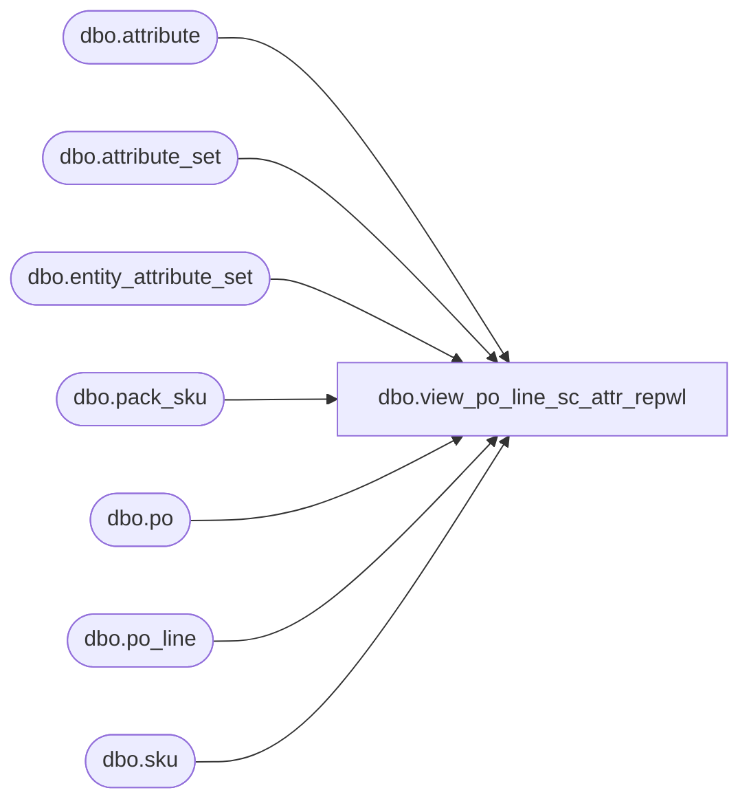

# dbo.view_po_line_sc_attr_repwl

**Database:** me_01  
**Server:** bedrockdb02  

## Architecture Diagram



## Table Dependencies

| Referenced Table |
|---|
| dbo.attribute |
| dbo.attribute_set |
| dbo.entity_attribute_set |
| dbo.pack_sku |
| dbo.po |
| dbo.po_line |
| dbo.sku |

## View Code

```sql
create view dbo.view_po_line_sc_attr_repwl 

AS
SELECT 	DISTINCT
		po.po_id,
		COALESCE (pl.po_line_id, 0) AS po_line_id,
		eas.attribute_set_id,
		eas.attribute_id,
		a.attribute_code, 
		a.attribute_label,
		ats.attribute_set_code,
		ats.attribute_set_label
FROM	po
		LEFT OUTER JOIN po_line pl ON (po.po_id = pl.po_id)
		LEFT OUTER JOIN entity_attribute_set eas ON (pl.style_color_id = eas.parent_id AND eas.parent_type = 19)
		LEFT OUTER JOIN attribute a ON (eas.attribute_id = a.attribute_id)
		LEFT OUTER JOIN attribute_set ats ON (eas.attribute_set_id = ats.attribute_set_id)
WHERE 	pl.pack_id IS NULL
UNION
SELECT 	DISTINCT
		po.po_id,
		COALESCE (pl.po_line_id, 0) AS po_line_id,
		eas.attribute_set_id,
		eas.attribute_id,
		a.attribute_code, 
		a.attribute_label,
		ats.attribute_set_code,
		ats.attribute_set_label
FROM	po
		LEFT OUTER JOIN (po_line pl 
						INNER JOIN pack_sku ps ON (pl.pack_id = ps.pack_id)
						INNER JOIN sku ON (ps.sku_id = sku.sku_id))
		ON (po.po_id = pl.po_id)
		LEFT OUTER JOIN entity_attribute_set eas ON (sku.style_color_id = eas.parent_id AND eas.parent_type = 19)
		LEFT OUTER JOIN attribute a ON (eas.attribute_id = a.attribute_id)
		LEFT OUTER JOIN attribute_set ats ON (eas.attribute_set_id = ats.attribute_set_id)
WHERE 	pl.pack_id IS NOT NULL
```

