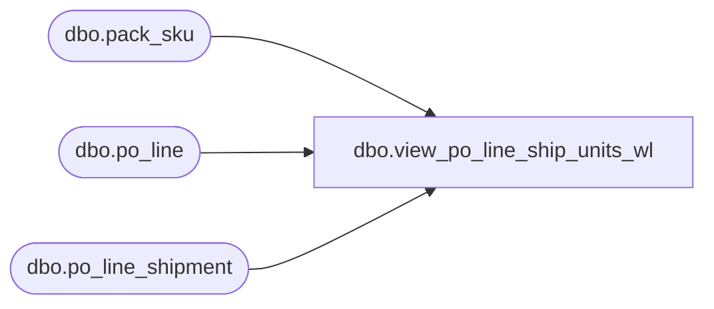

# dbo.view_po_line_ship_units_wl

**Database:** me_01  
**Server:** bedrockdb02  

## Architecture Diagram



## Table Dependencies

| Referenced Table |
|---|
| dbo.pack_sku |
| dbo.po_line |
| dbo.po_line_shipment |

## View Code

```sql
CREATE view [dbo].view_po_line_ship_units_wl

AS
SELECT  pls.po_id ,
        pls.po_line_id ,
        pls.po_shipment_id ,
        pls.quantity ,
        pls.net_final_cost ,
        ( pls.quantity * COALESCE(pkQty.TotalQty, 1) ) AS totalUnits ,
        CASE WHEN pl.pack_id IS NULL THEN 0
             ELSE pls.quantity
        END AS total_pack_units
       , (pls.quantity * pls.net_final_cost) AS totalNetFinalCost
FROM    po_line_shipment AS pls
        JOIN po_line AS pl ON pls.po_id = pl.po_id
                              AND pls.po_line_id = pl.po_line_id
        LEFT JOIN (SELECT pack_id, SUM(sku_quantity) TotalQty
                                  FROM pack_sku
                                  GROUP BY pack_id) AS pkQty ON pl.pack_id = pkQty.pack_id
```

