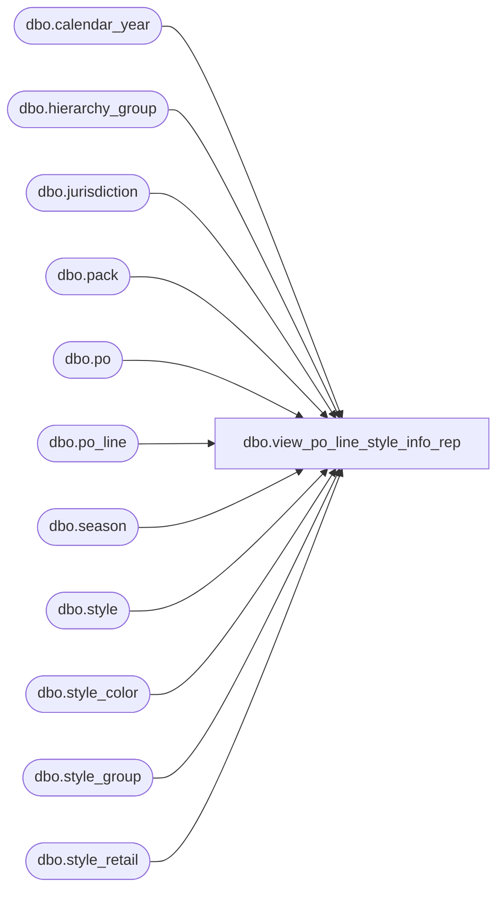

# dbo.view_po_line_style_info_rep

**Database:** me_01  
**Server:** bedrockdb02  

## Architecture Diagram



## Table Dependencies

| Referenced Table |
|---|
| dbo.calendar_year |
| dbo.hierarchy_group |
| dbo.jurisdiction |
| dbo.pack |
| dbo.po |
| dbo.po_line |
| dbo.season |
| dbo.style |
| dbo.style_color |
| dbo.style_group |
| dbo.style_retail |

## View Code

```sql
CREATE
view dbo.view_po_line_style_info_rep

AS
SELECT	po.po_id,
	pl.po_line_id,
	sc.style_id,
	sr.compare_at_retail,
	se.season_code,
	se.season_description,
	cy.calendar_year_code,
	hg.hierarchy_group_code,
	hg.hierarchy_group_label
FROM	po
	LEFT OUTER JOIN (po_line pl
			INNER JOIN style_color sc
			ON (sc.style_color_id = pl.style_color_id)
			INNER JOIN style s
			ON (sc.style_id = s.style_id)
			INNER JOIN season se
			ON (s.season_id = se.season_id)
			LEFT OUTER JOIN calendar_year cy
			ON (s.calendar_year_id = cy.calendar_year_id)
			LEFT OUTER JOIN (style_group sg 
					INNER JOIN hierarchy_group hg
					ON (sg.hierarchy_group_id = hg.hierarchy_group_id))
			ON (sc.style_id = sg.style_id AND sg.main_group_flag = 1)
			LEFT OUTER JOIN (style_retail sr 
					INNER JOIN jurisdiction j 
					ON (j.jurisdiction_id = sr.jurisdiction_id
						AND j.home_jurisdiction_flag = 1))
			ON (sc.style_id = sr.style_id))
	ON (po.po_id = pl.po_id)
WHERE pl.pack_id IS NULL		
UNION ALL
SELECT	po.po_id,
	pl.po_line_id,
	p.style_id,
	sr.compare_at_retail,
	se.season_code,
	se.season_description,
	cy.calendar_year_code,
	hg.hierarchy_group_code,
	hg.hierarchy_group_label
FROM	po
	INNER JOIN po_line pl
	ON (po.po_id = pl.po_id)
	INNER JOIN pack p
	ON (pl.pack_id = p.pack_id)
	INNER JOIN style s
	ON (p.style_id = s.style_id)
	INNER JOIN season se
	ON (s.season_id = se.season_id)
	LEFT OUTER JOIN calendar_year cy
	ON (s.calendar_year_id = cy.calendar_year_id)
	LEFT OUTER JOIN (style_group sg 
			INNER JOIN hierarchy_group hg
			ON (sg.hierarchy_group_id = hg.hierarchy_group_id))
	ON (p.style_id = sg.style_id AND sg.main_group_flag = 1)
	LEFT OUTER JOIN (style_retail sr 
			INNER JOIN jurisdiction j 
			ON (j.jurisdiction_id = sr.jurisdiction_id
				AND j.home_jurisdiction_flag = 1))
	ON (p.style_id = sr.style_id)
WHERE pl.pack_id IS NOT	NULL
```

