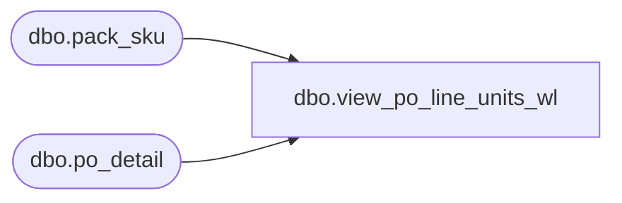

# dbo.view_po_line_units_wl

**Database:** me_01  
**Server:** bedrockdb02  

## Architecture Diagram



## Table Dependencies

| Referenced Table |
|---|
| dbo.pack_sku |
| dbo.po_detail |

## View Code

```sql
create view dbo.view_po_line_units_wl 
AS
SELECT po_id, po_line_id, sum(ordered_units) 'total_units'
FROM po_detail
WHERE pack_id IS NULL
GROUP BY po_id, po_line_id
UNION 
SELECT po_id, po_line_id, sum(ordered_units * sku_quantity) 'total_units'
FROM po_detail d
INNER JOIN pack_sku ps ON (d.pack_id = ps.pack_id)
WHERE d.pack_id IS NOT NULL
GROUP BY po_id, po_line_id
```

