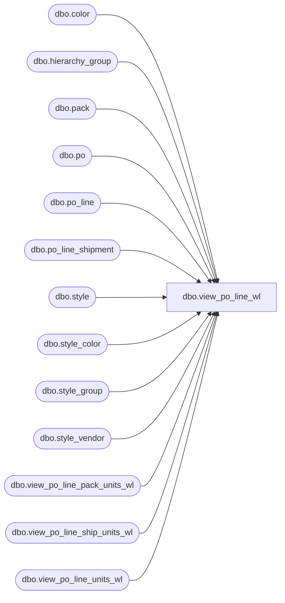

# dbo.view_po_line_wl

**Database:** me_01  
**Server:** bedrockdb02  

## Architecture Diagram



## Table Dependencies

| Referenced Table |
|---|
| dbo.color |
| dbo.hierarchy_group |
| dbo.pack |
| dbo.po |
| dbo.po_line |
| dbo.po_line_shipment |
| dbo.style |
| dbo.style_color |
| dbo.style_group |
| dbo.style_vendor |
| dbo.view_po_line_pack_units_wl |
| dbo.view_po_line_ship_units_wl |
| dbo.view_po_line_units_wl |

## View Code

```sql
CREATE VIEW [dbo].[view_po_line_wl]
AS
SELECT 	DISTINCT
		po.po_id,
		COALESCE(pl.po_line_id, 0) AS po_line_id,
		pl.line_no,
		s.style_id,
		s.style_code,
		s.long_desc,
		s.short_desc,
		v.vendor_style,
		NULL pack_code,
		NULL pack_description,
		NULL pack_short_description,
		NULL vendor_pack_code,
		c.color_code,
		c.color_long_description,
		c.color_short_description,
		COALESCE(s.distribution_multiple, 0) AS distribution_multiple,
		COALESCE(s.order_multiple, 0) AS order_multiple,
		h.hierarchy_group_id,
		h.hierarchy_group_code,
		h.hierarchy_group_short_label,
		h.hierarchy_group_label,
		pl.first_cost * lu.total_units AS total_line_first_cost,
		pl.net_cost * lu.total_units AS total_line_net_cost,
		pl.net_final_cost * lu.total_units AS total_line_net_final_cost,
		pl.total_ordered_retail,
        pl.repeat_order_flag,
		pl.store_pack_flag,
		lu.total_units,
		Null total_pack_units
FROM 	po
		LEFT OUTER JOIN po_line pl ON (po.po_id = pl.po_id)
		LEFT OUTER JOIN style_color sc ON (sc.style_color_id = pl.style_color_id)
		LEFT OUTER JOIN style s ON (sc.style_id = s.style_id)
		LEFT OUTER JOIN color c ON (sc.color_id = c.color_id)
		LEFT OUTER JOIN style_vendor v ON (sc.style_id = v.style_id AND v.vendor_id = po.vendor_id)
		LEFT OUTER JOIN style_group sg ON (sc.style_id = sg.style_id AND sg.main_group_flag = 1)
		LEFT OUTER JOIN hierarchy_group h ON (sg.hierarchy_group_id = h.hierarchy_group_id)
		LEFT OUTER JOIN view_po_line_units_wl lu ON (pl.po_id = lu.po_id AND pl.po_line_id = lu.po_line_id)
WHERE 	po.line_shipment_cost_factors_flag = 0 AND (pl.style_color_id IS NOT NULL
		OR (pl.pack_id IS NULL AND pl.style_color_id IS NULL) )
UNION ALL
SELECT	po.po_id,
		pl.po_line_id,
		pl.line_no,
		s.style_id,
		s.style_code,
		s.long_desc,
		s.short_desc,
		v.vendor_style,
		pack_code,
		pack_description,
		pack_short_description,
		vendor_pack_code,
		NULL AS color_code,
		NULL AS color_long_description,
		NULL AS color_short_description,
		COALESCE(s.distribution_multiple, 0) AS distribution_multiple,
		COALESCE(s.order_multiple, 0) AS order_multiple,
		h.hierarchy_group_id,
		h.hierarchy_group_code,
		h.hierarchy_group_short_label,
		h.hierarchy_group_label,
		pl.first_cost * lu.total_units AS total_line_first_cost,
		pl.net_cost * lu.total_units AS total_line_net_cost,
		pl.net_final_cost * lu.total_units AS total_line_net_final_cost,
		pl.total_ordered_retail,
		pl.repeat_order_flag,
		pl.store_pack_flag,
		lu.total_units,
		pd.total_pack_units
FROM 	po
		INNER JOIN po_line pl ON (po.po_id = pl.po_id)
		INNER JOIN pack p ON (p.pack_id = pl.pack_id)
		INNER JOIN style s ON (p.style_id = s.style_id)
		LEFT OUTER JOIN style_vendor v ON (p.style_id = v.style_id AND v.vendor_id = po.vendor_id)
		LEFT OUTER JOIN style_group sg ON (p.style_id = sg.style_id AND sg.main_group_flag = 1)
		LEFT OUTER JOIN hierarchy_group h ON (sg.hierarchy_group_id = h.hierarchy_group_id)
		LEFT OUTER JOIN view_po_line_units_wl lu ON (pl.po_id = lu.po_id AND pl.po_line_id = lu.po_line_id)
		left outer join view_po_line_pack_units_wl pd ON (pd.po_id = pl.po_id AND pd.po_line_id = pl.po_line_id )
WHERE 	po.line_shipment_cost_factors_flag = 0 AND pl.pack_id IS NOT NULL
UNION ALL
SELECT 	DISTINCT
		po.po_id,
		COALESCE(pl.po_line_id, 0) AS po_line_id,
		pl.line_no,
		s.style_id,
		s.style_code,
		s.long_desc,
		s.short_desc,
		v.vendor_style,
		CASE WHEN pl.pack_id IS NULL THEN NULL
			ELSE p.pack_code
			END AS pack_code,
		CASE WHEN pl.pack_id IS NULL THEN NULL
			ELSE p.pack_description
			END AS pack_description,
		CASE WHEN pl.pack_id IS NULL THEN NULL
			ELSE p.pack_short_description
			END AS pack_short_description,
		CASE WHEN pl.pack_id IS NULL THEN NULL
			ELSE p.vendor_pack_code
			END AS vendor_pack_code,
		c.color_code,
		c.color_long_description,
		c.color_short_description,
		COALESCE(s.distribution_multiple, 0) AS distribution_multiple,
		COALESCE(s.order_multiple, 0) AS order_multiple,
		h.hierarchy_group_id,
		h.hierarchy_group_code,
		h.hierarchy_group_short_label,
		h.hierarchy_group_label,
		pl.first_cost * tpls.total_units AS total_line_first_cost,
		pl.net_cost * tpls.total_units AS total_line_net_cost,
		tpls.po_line_total_net_final_cost AS total_line_net_final_cost,
		pl.total_ordered_retail,
		pl.repeat_order_flag,
		pl.store_pack_flag,
		tpls.total_units,
		tpls.total_pack_units
FROM 	po
		LEFT OUTER JOIN po_line pl ON (po.po_id = pl.po_id)
		LEFT JOIN
		(
			SELECT
				lsu.po_id
				,lsu.po_line_id
				,SUM(lsu.quantity) AS quantity
				,SUM(ps.net_final_cost * ps.quantity) po_line_total_net_final_cost
				,SUM(lsu.totalUnits) AS total_units
				,SUM(lsu.total_pack_units) AS total_pack_units
			FROM
				view_po_line_ship_units_wl lsu
				JOIN po_line_shipment ps ON ps.po_id = lsu.po_id AND ps.po_line_id = lsu.po_line_id AND ps.po_shipment_id = lsu.po_shipment_id
			GROUP BY
				lsu.po_id
				,lsu.po_line_id

		) tpls ON tpls.po_id = pl.po_id AND tpls.po_line_id = pl.po_line_id
		LEFT OUTER JOIN pack p ON (p.pack_id = pl.pack_id)
		LEFT OUTER JOIN style_color sc ON (sc.style_color_id = pl.style_color_id)
		LEFT OUTER JOIN style s ON (sc.style_id = s.style_id)
		LEFT OUTER JOIN color c ON (sc.color_id = c.color_id)
		LEFT OUTER JOIN style_vendor v ON (sc.style_id = v.style_id AND v.vendor_id = po.vendor_id)
		LEFT OUTER JOIN style_group sg ON (sc.style_id = sg.style_id AND sg.main_group_flag = 1)
		LEFT OUTER JOIN hierarchy_group h ON (sg.hierarchy_group_id = h.hierarchy_group_id)
WHERE po.line_shipment_cost_factors_flag = 1
```

