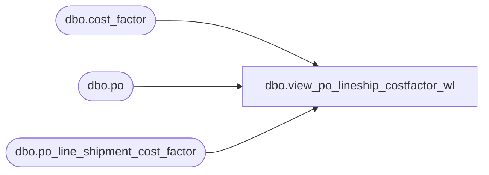

# dbo.view_po_lineship_costfactor_wl

**Database:** me_01  
**Server:** bedrockdb02  

## Architecture Diagram



## Table Dependencies

| Referenced Table |
|---|
| dbo.cost_factor |
| dbo.po |
| dbo.po_line_shipment_cost_factor |

## View Code

```sql
create view dbo.view_po_lineship_costfactor_wl

AS
SELECT 	DISTINCT
		po.po_id,
		COALESCE(plsc.po_line_id, 0) AS po_line_id,
		plsc.po_shipment_id,
		plsc.cost_factor_id,
		cost_factor_code,
		cost_factor_description
FROM	po
		LEFT OUTER JOIN po_line_shipment_cost_factor plsc
		ON (po.po_id = plsc.po_id )
		LEFT OUTER JOIN cost_factor cf
		ON (cf.cost_factor_id = plsc.cost_factor_id)
```

