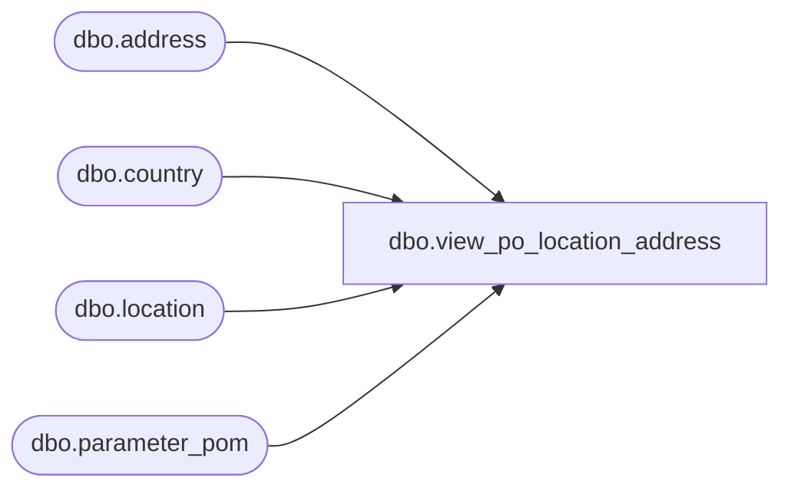

# dbo.view_po_location_address

**Database:** me_01  
**Server:** bedrockdb02  

## Architecture Diagram



## Table Dependencies

| Referenced Table |
|---|
| dbo.address |
| dbo.country |
| dbo.location |
| dbo.parameter_pom |

## View Code

```sql
create view dbo.view_po_location_address 
AS
SELECT	location_id,
	 	address_name,
		address_line1,
		address_line2,
		address_city,
		address_state,
		address_zip_code,
		country_description
FROM	location l
		LEFT OUTER JOIN (address a
						INNER JOIN country c
						ON (a.country_id = c.country_id)
						INNER JOIN parameter_pom pp
						ON (pp.rec_loc_address_type_to_print = a.address_type_id))
		ON (l.location_id = a.parent_id
			AND a.parent_type = 2)
```

