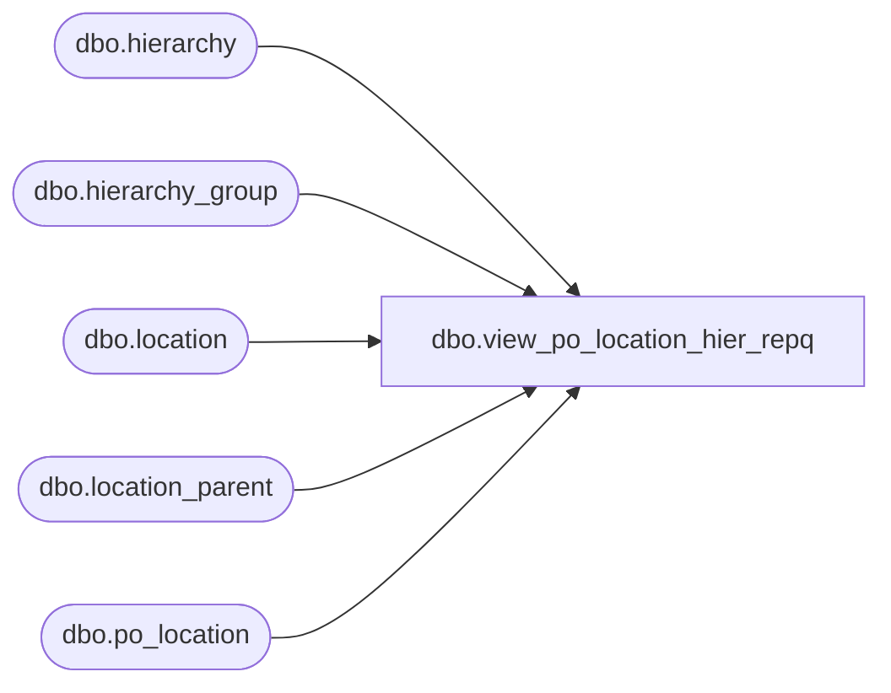

# dbo.view_po_location_hier_repq

**Database:** me_01  
**Server:** bedrockdb02  

## Architecture Diagram



## Table Dependencies

| Referenced Table |
|---|
| dbo.hierarchy |
| dbo.hierarchy_group |
| dbo.location |
| dbo.location_parent |
| dbo.po_location |

## View Code

```sql
create view dbo.view_po_location_hier_repq 


AS
SELECT	po_id,
		l.location_code,
		hg.hierarchy_group_code
FROM	po_location ploc
		INNER JOIN location l ON (ploc.location_id = l.location_id)
		INNER JOIN location_parent lp ON (lp.location_id = l.location_id)
		INNER JOIN hierarchy_group hg ON (lp.parent_hierarchy_group_id = hg.hierarchy_group_id)
		INNER JOIN hierarchy h ON (hg.hierarchy_id = h.hierarchy_id)
WHERE	h.alternate_flag = 0
GROUP BY po_id,
		l.location_code,
		hg.hierarchy_group_code
```

