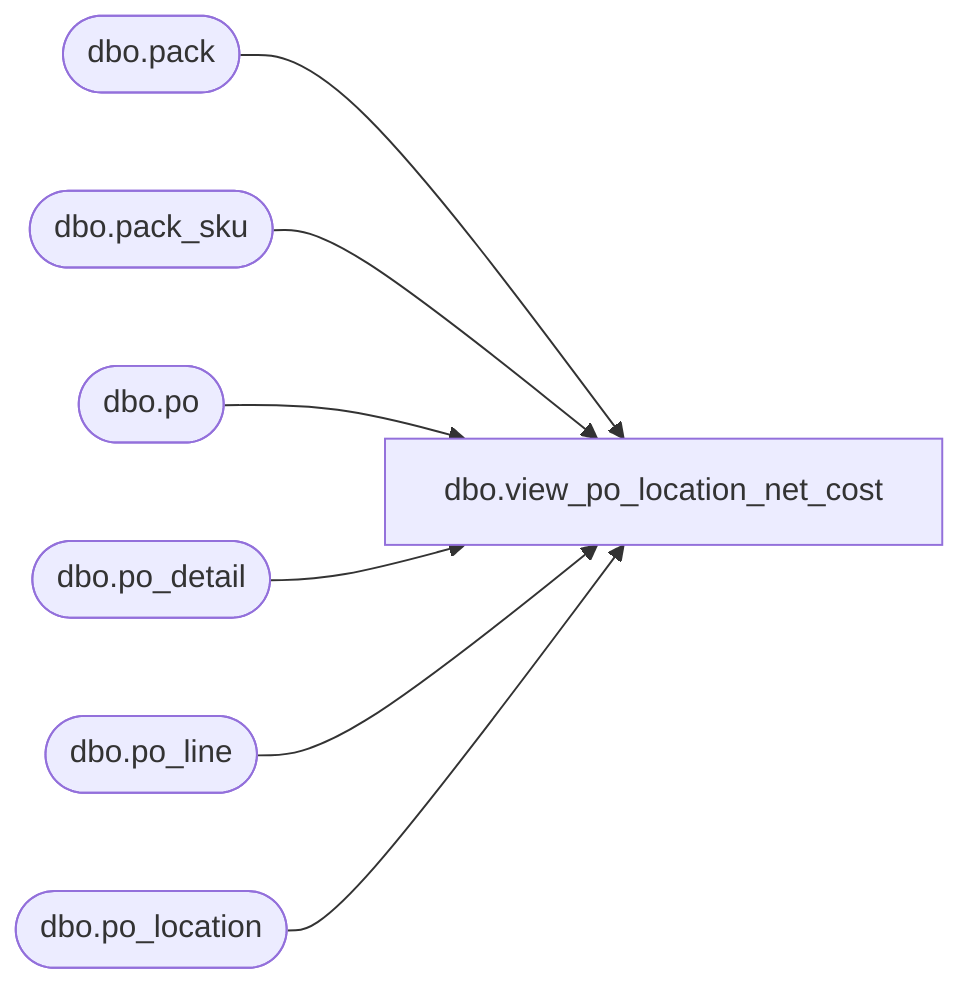

# dbo.view_po_location_net_cost

**Database:** me_01  
**Server:** bedrockdb02  

## Architecture Diagram



## Table Dependencies

| Referenced Table |
|---|
| dbo.pack |
| dbo.pack_sku |
| dbo.po |
| dbo.po_detail |
| dbo.po_line |
| dbo.po_location |

## View Code

```sql
CREATE  VIEW [dbo].[view_po_location_net_cost] AS
SELECT pll.po_id, pll.location_id, Round(SUM(location_cost_domestic), 2 ) AS total_loc_net_cost
FROM po_location pll, 
(SELECT po_location_id, pl.po_id, lu.location_units * pl.net_cost * exchange_rate as location_cost_domestic 
FROM po_line pl, po,
(SELECT po_line_id, po_detail.po_location_id, po_id, SUM(ordered_units) AS location_units 
FROM po_detail WHERE pack_id IS NULL AND (total_ordered_pseudo_cost IS NULL OR total_ordered_pseudo_cost = 0)
GROUP BY po_line_id, po_location_id, po_id
UNION ALL
SELECT po_line_id, po_detail.po_location_id, po_id, SUM(ordered_units*sku_quantity) AS location_units 
FROM po_detail, pack, (SELECT pack_id,  sum(sku_quantity) AS sku_quantity 
FROM pack_sku as sku_quantity GROUP BY pack_id) psk 
WHERE po_detail.pack_id IS NOT NULL
AND po_detail.pack_id = psk.pack_id 
GROUP BY po_line_id, po_location_id, po_id
) lu 
WHERE pl.po_line_id = lu.po_line_id
AND pl.po_id = lu.po_id
and po.po_id = pl.po_id
UNION ALL
SELECT pd.po_location_id, pl.po_id, pd.total_ordered_pseudo_cost * exchange_rate as location_cost_domestic 
FROM po_line pl, po_detail pd, po 
WHERE pl.po_id = pd.po_id 
AND pl.po_line_id = pd.po_line_id 
and po.po_id = pl.po_id
and po.po_id = pd.po_id
AND total_ordered_pseudo_cost IS NOT NULL) lc 
WHERE lc.po_location_id = pll.po_location_id 
AND lc.po_id = pll.po_id
GROUP BY pll.location_id, lc.po_location_id, pll.po_id
```

