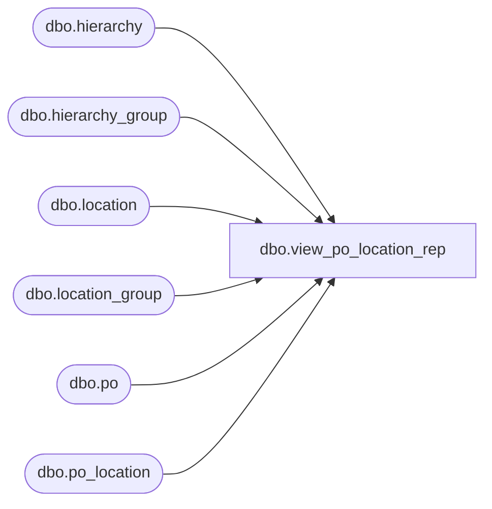

# dbo.view_po_location_rep

**Database:** me_01  
**Server:** bedrockdb02  

## Architecture Diagram



## Table Dependencies

| Referenced Table |
|---|
| dbo.hierarchy |
| dbo.hierarchy_group |
| dbo.location |
| dbo.location_group |
| dbo.po |
| dbo.po_location |

## View Code

```sql
create view dbo.view_po_location_rep 

AS
SELECT 	DISTINCT
	po.po_id,
	pl.po_location_id,
	l.location_id,
	l.location_code,
	l.location_name,
	l.location_short_name,
	l.location_type,
	lg.hierarchy_group_id,
	hg.hierarchy_group_code,
	hg.hierarchy_group_label
FROM	po
LEFT OUTER JOIN po_location pl ON (po.po_id = pl.po_id)
LEFT OUTER JOIN location l ON (pl.location_id = l.location_id)
LEFT OUTER JOIN location_group lg ON (lg.location_id = l.location_id)
LEFT OUTER JOIN hierarchy_group hg ON (lg.hierarchy_group_id = hg.hierarchy_group_id)
LEFT OUTER JOIN hierarchy h ON (hg.hierarchy_id = h.hierarchy_id)
WHERE	h.alternate_flag = 0
```

