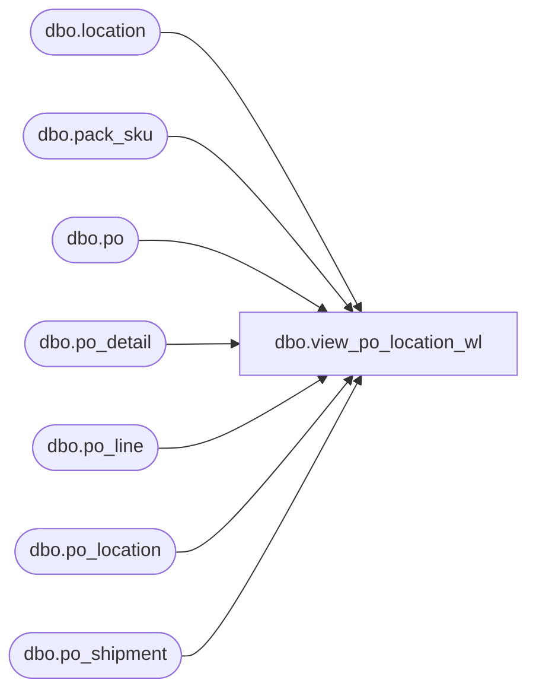

# dbo.view_po_location_wl

**Database:** me_01  
**Server:** bedrockdb02  

## Architecture Diagram



## Table Dependencies

| Referenced Table |
|---|
| dbo.location |
| dbo.pack_sku |
| dbo.po |
| dbo.po_detail |
| dbo.po_line |
| dbo.po_location |
| dbo.po_shipment |

## View Code

```sql
/*
	Date		Who			What
	2015/09/28	Feng Li		fix defect 141857 PO Worklist layout. In Merch 4.2 the field 'Total Location Net Cost' existed under the Location folder as a field to add to the PO Worklist. In Merch 5.0 it is gone.

*/

create view [dbo].[view_po_location_wl]

AS
SELECT  po.po_id ,
        ps.po_shipment_id ,
        polc.po_location_id ,
        polc.location_id ,
        polc.location_code ,
        polc.location_name ,
        polc.location_short_name ,
        polc.location_type ,
        polc.total_loc_net_cost
FROM    po
        JOIN po_shipment AS ps ON po.po_id = ps.po_id
        LEFT OUTER JOIN ( SELECT    plc.po_id ,
                                    po_shipment_id ,
                                    lsu.po_location_id ,
                                    plc.location_id ,
                                    l.location_code ,
                                    l.location_name ,
                                    l.location_short_name ,
                                    l.location_type ,
                                    ROUND(SUM(location_cost_domestic), 2) AS total_loc_net_cost
                          FROM      po_location plc ,
                                    ( SELECT    pl.po_id ,
                                                po_shipment_id ,
                                                lu.po_location_id AS po_location_id ,
                                                lu.location_units * pl.net_cost * exchange_rate AS location_cost_domestic
                                      FROM      po_line pl ,
                                                po ,
                                                ( SELECT    po_id ,
                                                            po_line_id ,
                                                            po_detail.po_shipment_id ,
                                                            po_detail.po_location_id ,
                                                            ordered_units AS location_units
                                                  FROM      po_detail
                                                  WHERE     pack_id IS NULL AND ( total_ordered_pseudo_cost IS NULL OR total_ordered_pseudo_cost = 0 )
                                                  UNION ALL
                                                  SELECT    po_id ,
                                                            po_line_id ,
                                                            po_detail.po_shipment_id ,
                                                            po_detail.po_location_id ,
                                                            ordered_units * sku_quantity AS location_units
                                                  FROM      po_detail ,
                                                            ( SELECT
                                                              pack_id ,
                                                              SUM(sku_quantity) AS sku_quantity
                                                              FROM
                                                              pack_sku AS sku_quantity
                                                              GROUP BY pack_id
                                                            ) psk
                                                  WHERE     po_detail.pack_id IS NOT NULL
                                                            AND po_detail.pack_id = psk.pack_id
                                                ) lu
                                      WHERE     pl.po_line_id = lu.po_line_id
                                                AND pl.po_id = lu.po_id
                                                AND po.po_id = pl.po_id
                                      UNION ALL
                                      SELECT    pd.po_id ,
                                                pd.po_shipment_id ,
                                                pd.po_location_id ,
                                                pd.total_ordered_pseudo_cost
                                                * exchange_rate AS location_cost_domestic
                                      FROM      po_detail pd ,
                                                po
                                      WHERE     po.po_id = pd.po_id
                                                AND total_ordered_pseudo_cost IS NOT NULL
                                                AND total_ordered_pseudo_cost > 0
                                    ) lsu ,
                                    location l
                          WHERE     l.location_id = plc.location_id
                                    AND lsu.po_location_id = plc.po_location_id
                                    AND lsu.po_id = plc.po_id
                          GROUP BY  plc.po_id ,
                                    po_shipment_id ,
                                    lsu.po_location_id ,
                                    plc.location_id ,
                                    l.location_code ,
                                    l.location_name ,
                                    l.location_short_name ,
                                    l.location_type
                        ) polc ON po.po_id = polc.po_id
                                  AND ps.po_id = polc.po_id
                                  AND ps.po_shipment_id = polc.po_shipment_id
```

