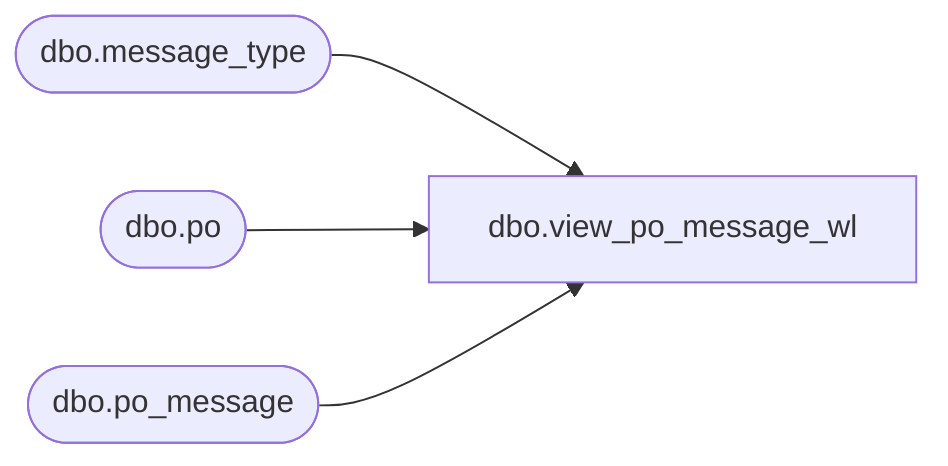

# dbo.view_po_message_wl

**Database:** me_01  
**Server:** bedrockdb02  

## Architecture Diagram



## Table Dependencies

| Referenced Table |
|---|
| dbo.message_type |
| dbo.po |
| dbo.po_message |

## View Code

```sql
create view dbo.view_po_message_wl 


AS
SELECT	DISTINCT
		po.po_id,
		pm.message_type_id,
		COALESCE(pm.message, N'') as message,
		COALESCE(m.message_type_description, N'') as message_type_description,
		COALESCE(m.print_message_for_vendor_flag,0) as print_message_for_vendor_flag,
		COALESCE(m.user_defined_flag,0) as user_defined_flag,
		COALESCE(m.edi_support_flag,0) as edi_support_flag
FROM	po
		LEFT OUTER JOIN po_message pm 
		ON (po.po_id = pm.po_id)
		LEFT OUTER JOIN message_type m 
		ON (pm.message_type_id = m.message_type_id)
```

