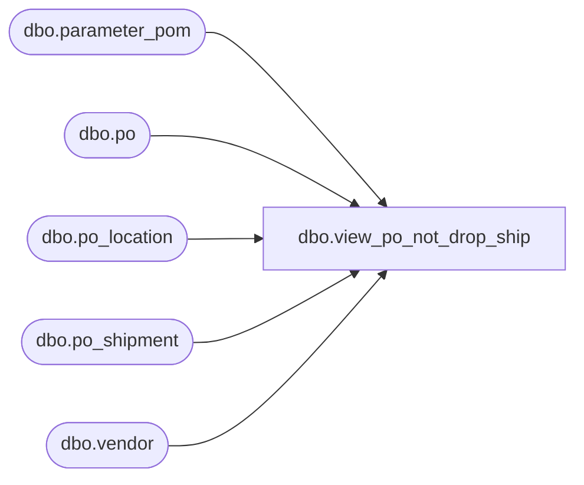

# dbo.view_po_not_drop_ship

**Database:** me_01  
**Server:** bedrockdb02  

## Architecture Diagram



## Table Dependencies

| Referenced Table |
|---|
| dbo.parameter_pom |
| dbo.po |
| dbo.po_location |
| dbo.po_shipment |
| dbo.vendor |

## View Code

```sql
create view dbo.view_po_not_drop_ship 

         (doc_type,
          doc_no,
          from_location_id,
          to_location_id,
          create_date,
          receive_date,
          status,
          description,
          doc_id,
          display_location_id,
          grouping_label,
          secondary_type,
          vendor_code,
          vendor_name,
          transaction_reason_id,
          performed_by, 
          cartons_arrived, 
          total_cartons,
          match_status,
          shipment_ref_no)
AS
   SELECT N'PO',
          po.po_no,
          CAST(null AS smallint),
          pol.location_id,
	  convert(smalldatetime,convert(char(12),po.create_date,109)),
	  convert(smalldatetime,convert(char(12),pos.expected_receipt_date,109)),
          3 * po.po_status + 7,
          po.po_description,
          po.po_id,
          pol.location_id,
          CAST(null AS nvarchar(20)),
          0,
          vendor.vendor_code,
          vendor.vendor_name,
          CAST(null AS smallint),
          CAST(null AS nvarchar(60)),
          CAST(null AS int),
          CAST(null AS int),
          CAST(null AS smallint),
          CAST(null AS nvarchar(30))
     FROM dbo.vendor,
          dbo.parameter_pom p,
          dbo.po_location pol,
	  dbo.po LEFT OUTER JOIN po_shipment pos ON po.po_id = pos.po_id
				AND ((SELECT count(expected_receipt_date) 
   						      FROM po_shipment pos 
		  				      WHERE pos.po_id = po.po_id) = 1)
    WHERE po.predistribution_type <> 2
      AND po.po_type <> 2
      AND (po.po_status = 4  OR  po.po_status = 5)
      AND (po.approval_status = 3           OR
           po.approval_status = 7           OR
           p.using_po_approval_flag = 0     OR
           NOT (po.approval_category = 2    AND
                p.approve_release_po_flag = 1        OR
                po.approval_category = 3    AND
                p.approve_standalone_po_flag = 1     OR
                po.approval_category = 4    AND
                p.approve_special_po_flag = 1        OR
                po.approval_category = 5))
      AND po.vendor_id = vendor.vendor_id
      AND po.po_id = pol.po_id
```

