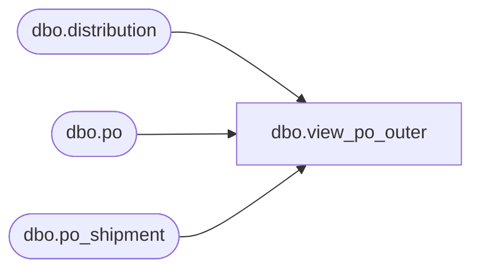

# dbo.view_po_outer

**Database:** me_01  
**Server:** bedrockdb02  

## Architecture Diagram



## Table Dependencies

| Referenced Table |
|---|
| dbo.distribution |
| dbo.po |
| dbo.po_shipment |

## View Code

```sql
create view dbo.view_po_outer
AS
SELECT DISTINCT d.distribution_id, po.po_id, po.po_no, COALESCE(po.po_description, N'') as po_description, 
po.predistribution_type, ps.expected_receipt_date, ps.sourcing_line_ship_id
FROM po po 
RIGHT OUTER JOIN distribution d ON po.po_id = d.po_id 
LEFT OUTER JOIN po_shipment ps ON po.po_id = ps.po_id
```

