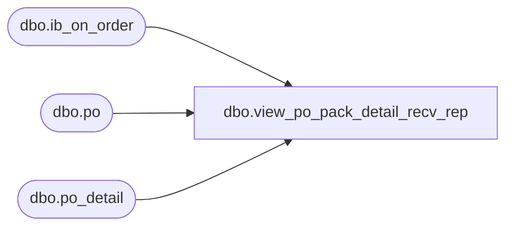

# dbo.view_po_pack_detail_recv_rep

**Database:** me_01  
**Server:** bedrockdb02  

## Architecture Diagram



## Table Dependencies

| Referenced Table |
|---|
| dbo.ib_on_order |
| dbo.po |
| dbo.po_detail |

## View Code

```sql
create view dbo.view_po_pack_detail_recv_rep 

AS 
SELECT	po.po_id, 
		pd.po_line_id, 
		ISNULL(SUM(CONVERT(DECIMAL(12,0), ioo.received_units)), 0) as received_units, 
		ISNULL(SUM(CONVERT(DECIMAL(14,2), ioo.received_retail)), 0) as received_retail, 
		ISNULL(SUM(CONVERT(DECIMAL(14,2), ioo.received_cost)), 0) as received_cost
FROM	po 
		INNER JOIN
		(SELECT DISTINCT
				po_id, 
				po_line_id,
				pack_id
		FROM	po_detail
		WHERE	pack_id IS NOT NULL) pd
		ON (pd.po_id = po.po_id) 
		INNER JOIN (SELECT	pack_id,
							document_number, 
							ABS(SUM(on_order_units)) AS received_units, 
							ABS(SUM(on_order_valuation_retail)) AS received_retail,
							ABS(SUM(on_order_cost)) AS received_cost 
					FROM 	ib_on_order 
					WHERE 	transaction_type_code = 110  
							AND pack_id IS NOT NULL 
					GROUP BY pack_id,
							document_number
					) ioo  
		ON (po.po_no = ioo.document_number  
			AND po.po_status >= 4  
			AND ioo.pack_id = pd.pack_id)
GROUP BY po.po_id, 
		pd.po_line_id
```

