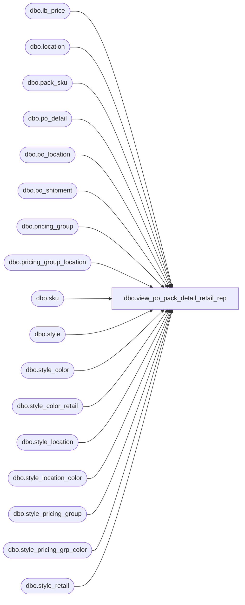

# dbo.view_po_pack_detail_retail_rep

**Database:** me_01  
**Server:** bedrockdb02  

## Architecture Diagram



## Table Dependencies

| Referenced Table |
|---|
| dbo.ib_price |
| dbo.location |
| dbo.pack_sku |
| dbo.po_detail |
| dbo.po_location |
| dbo.po_shipment |
| dbo.pricing_group |
| dbo.pricing_group_location |
| dbo.sku |
| dbo.style |
| dbo.style_color |
| dbo.style_color_retail |
| dbo.style_location |
| dbo.style_location_color |
| dbo.style_pricing_group |
| dbo.style_pricing_grp_color |
| dbo.style_retail |

## View Code

```sql
CREATE view dbo.view_po_pack_detail_retail_rep
AS
/**
NOTE THIS VIEW IS OBSOLETE AND RETURNS INCORRECT DATA.

			DO NOT USE THIS VIEW!  IT WILL BE REMOVED IN THE FUTURE.
**/

SELECT detail_ib.po_id,
  detail_ib.po_detail_id,
  SUM(detail_ib.sku_quantity * ib.valuation_retail_price) AS unit_retail
FROM (SELECT detail.po_id,
    detail.po_detail_id,
    detail.sku_id,
    detail.color_id,
    detail.sku_quantity AS sku_quantity,
    MAX(ib.ib_price_id) AS ib_price_id
  FROM (SELECT pd.po_id,
      pd.po_detail_id,
      psk.sku_id,
      sku.style_id,
      sc.color_id,
      ploc.location_id,
      l.jurisdiction_id,
      CASE
      WHEN ps.expected_receipt_date > GETDATE()
      THEN ps.expected_receipt_date
      ELSE CONVERT(SMALLDATETIME, FLOOR(CONVERT(FLOAT, GETDATE())))
      END 'detail_date',
      SUM(psk.sku_quantity) AS sku_quantity
    FROM po_detail pd
      INNER JOIN pack_sku psk
      ON (pd.pack_id = psk.pack_id)
      INNER JOIN sku
      ON (psk.sku_id = sku.sku_id)
      INNER JOIN style_color sc
      ON (sku.style_color_id = sc.style_color_id)
      INNER JOIN style s
      ON (sc.style_id = s.style_id
       AND s.style_status >= 3)
      INNER join po_location ploc
      ON (pd.po_id = ploc.po_id
       AND pd.po_location_id = ploc.po_location_id)
      INNER JOIN location l
      ON (ploc.location_id = l.location_id)
      INNER join po_shipment ps
      ON (pd.po_id = ps.po_id
       AND pd.po_shipment_id = ps.po_shipment_id)
    WHERE pd.pack_id IS NOT NULL
    GROUP BY pd.po_id,
      pd.po_detail_id,
      psk.sku_id,
      sku.style_id,
      sc.color_id,
      ploc.location_id,
      l.jurisdiction_id,
      CASE
      WHEN ps.expected_receipt_date > GETDATE()
      THEN ps.expected_receipt_date
      ELSE CONVERT(SMALLDATETIME, FLOOR(CONVERT(FLOAT, GETDATE())))
      END
    ) detail
    INNER JOIN ib_price ib
    ON (ib.style_id = detail.style_id
     AND ib.start_date <= detail.detail_date
     AND (ib.color_id IS NULL
      OR ib.color_id = detail.color_id)
     AND ((ib.location_id IS NULL
       AND ib.pricing_group_id IS NULL
       AND (ib.jurisdiction_id IS NULL
        OR ib.jurisdiction_id = detail.jurisdiction_id))
      OR ib.location_id = detail.location_id)
     AND ib.temp_price_flag = 0)
  GROUP BY detail.po_id,
    detail.po_detail_id,
    detail.sku_id,
    detail.color_id,
    detail.sku_quantity) detail_ib
  INNER JOIN ib_price ib
  ON (detail_ib.ib_price_id = ib.ib_price_id)
GROUP BY detail_ib.po_id,
  detail_ib.po_detail_id
UNION ALL
SELECT pd.po_id,
  pd.po_detail_id,
  SUM(sku_quantity * COALESCE(slc.original_valuation_retail,
         sl.original_valuation_retail,
         spgc.original_valuation_retail,
         spg.original_valuation_retail,
         scr.original_valuation_retail,
         sr.original_valuation_retail)) AS unit_retail
FROM  po_detail pd
  INNER JOIN pack_sku ps
  ON pd.pack_id = ps.pack_id
  INNER JOIN sku
  ON ps.sku_id = sku.sku_id
  INNER JOIN style_color sc
  ON sku.style_color_id = sc.style_color_id
  INNER JOIN style s
  ON sc.style_id = s.style_id
  INNER JOIN po_location ploc
  ON (ploc.po_id = pd.po_id
   AND ploc.po_location_id = pd.po_location_id)
  INNER JOIN location l
  ON (ploc.location_id = l.location_id)
  LEFT OUTER JOIN style_retail sr
  ON (sc.style_id = sr.style_id
   AND l.jurisdiction_id = sr.jurisdiction_id)
  LEFT OUTER JOIN style_color_retail scr
  ON (sc.style_color_id = scr.style_color_id
   AND l.jurisdiction_id = scr.jurisdiction_id)
  LEFT OUTER JOIN style_location sl
  ON (s.style_id = sl.style_id
   AND sl.location_id = ploc.location_id)
  LEFT OUTER JOIN style_location_color slc
  ON (sc.style_color_id = slc.style_color_id
   AND slc.location_id = ploc.location_id)
  LEFT OUTER JOIN pricing_group_location pgl
  ON (pgl.location_id = ploc.location_id)
  LEFT OUTER JOIN pricing_group pg
  ON (pg.pricing_group_id = pgl.pricing_group_id)
  LEFT OUTER JOIN style_pricing_group spg
  ON (spg.style_id = s.style_id
   AND pg.pricing_group_id = spg.pricing_group_id)
  LEFT OUTER JOIN style_pricing_grp_color spgc
  ON (spgc.style_color_id = sc.style_color_id
   AND pg.pricing_group_id = spgc.pricing_group_id)
WHERE pd.pack_id IS NOT NULL
  AND s.style_status < 3
GROUP BY pd.po_id,
  pd.po_detail_id
```

