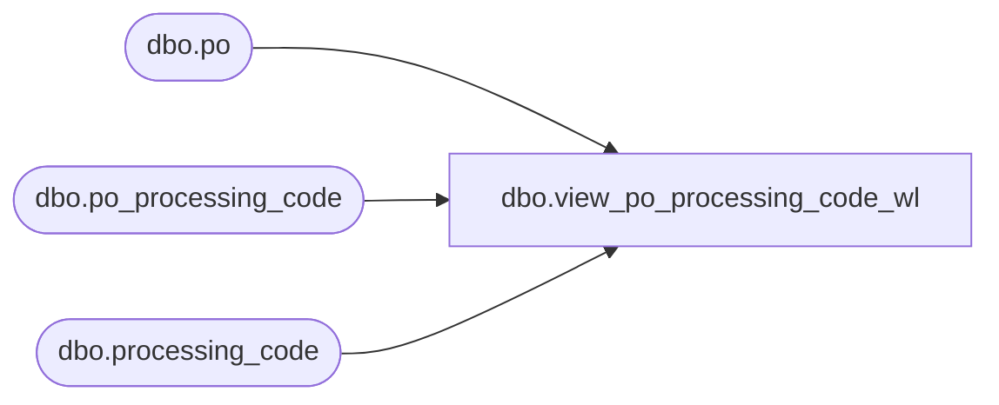

# dbo.view_po_processing_code_wl

**Database:** me_01  
**Server:** bedrockdb02  

## Architecture Diagram



## Table Dependencies

| Referenced Table |
|---|
| dbo.po |
| dbo.po_processing_code |
| dbo.processing_code |

## View Code

```sql
CREATE   VIEW dbo.view_po_processing_code_wl AS
SELECT 	DISTINCT
	po.po_id,
	ppc.processing_code_id,
	pc.processing_code, 
	pc.description,
	pc.process_type
FROM	po
LEFT OUTER JOIN po_processing_code ppc ON (po.po_id = ppc.po_id)
LEFT OUTER JOIN processing_code pc ON (pc.processing_code_id = ppc.processing_code_id)
```

