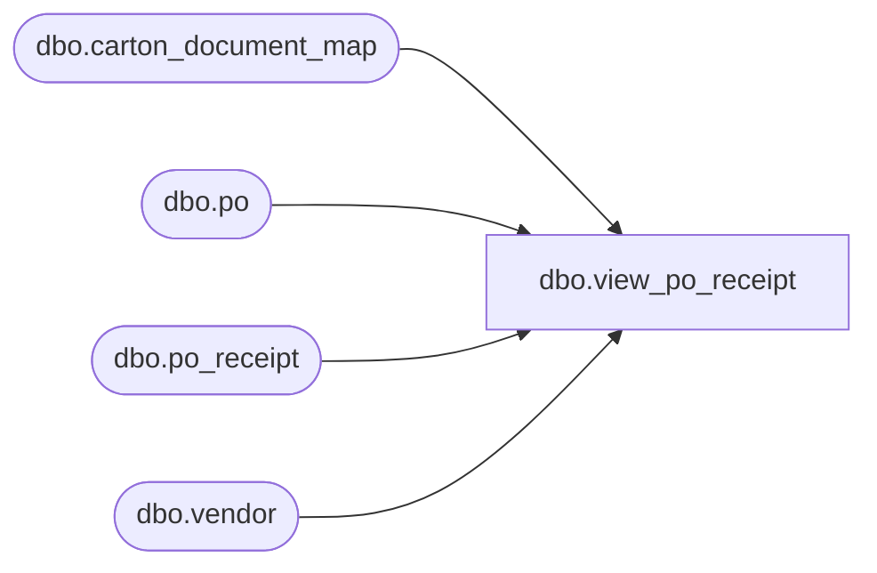

# dbo.view_po_receipt

**Database:** me_01  
**Server:** bedrockdb02  

## Architecture Diagram



## Table Dependencies

| Referenced Table |
|---|
| dbo.carton_document_map |
| dbo.po |
| dbo.po_receipt |
| dbo.vendor |

## View Code

```sql
create view dbo.view_po_receipt 
         (doc_type,
          doc_no,
          from_location_id,
          to_location_id,
          create_date,
          receive_date,
          status,
          description,
          doc_id,
          display_location_id,
          grouping_label,
          secondary_type,
          vendor_code,
          vendor_name,
          transaction_reason_id,
          performed_by,
          cartons_arrived, 
          total_cartons,
          match_status,
          shipment_ref_no)
AS
   SELECT N'POreceipt',
          po_receipt.document_no,
          CAST(null AS smallint),
          po_receipt.location_id,
	  convert(smalldatetime,convert(char(12),po_receipt.create_date,109)),
	  convert(smalldatetime,convert(char(12),po_receipt.receive_date,109)),
          po_receipt.document_status,
          po_receipt.document_description,
          po_receipt.po_receipt_id,
          po_receipt.location_id,
          po_receipt.grouping_label,
          0,
          vendor.vendor_code,
          vendor.vendor_name,
          po_receipt.transaction_reason_id,
          po_receipt.performed_by,
          (select count(*) from carton_document_map 
		where document_type = 5 
		  and document_id = po_receipt.po_receipt_id 
 		  and carton_arrived_flag = 1),
       	    (select count(*) from carton_document_map 
		where document_type = 5 
                  and document_id = po_receipt.po_receipt_id),
          po_receipt.match_status,
          CAST(null AS nvarchar(30))
     FROM po_receipt,
          po,
          vendor
    WHERE po_receipt.po_id = po.po_id
      AND po.vendor_id = vendor.vendor_id
```

