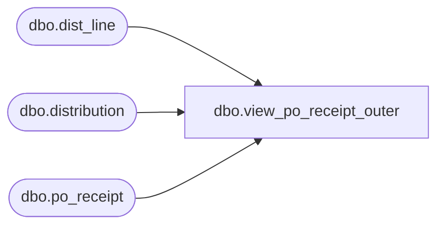

# dbo.view_po_receipt_outer

**Database:** me_01  
**Server:** bedrockdb02  

## Architecture Diagram



## Table Dependencies

| Referenced Table |
|---|
| dbo.dist_line |
| dbo.distribution |
| dbo.po_receipt |

## View Code

```sql
create view dbo.view_po_receipt_outer 
 AS
SELECT DISTINCT
  d.distribution_id,
   pr.po_receipt_id,
   pr.document_no, 
   pr.document_description, 
   pr.receive_date
FROM distribution d
 INNER JOIN   dist_line dl
 ON d.distribution_id = dl.distribution_id 
LEFT OUTER JOIN .po_receipt pr
 ON dl.po_receipt_id = pr.po_receipt_id
```

