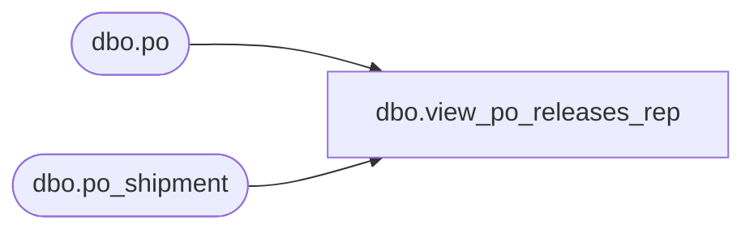

# dbo.view_po_releases_rep

**Database:** me_01  
**Server:** bedrockdb02  

## Architecture Diagram



## Table Dependencies

| Referenced Table |
|---|
| dbo.po |
| dbo.po_shipment |

## View Code

```sql
create view dbo.view_po_releases_rep 

AS
SELECT	a.po_id AS blanket_po_id, 
		b.po_id AS release_po_id, 
		b.po_no AS release_po_no,
		ps.expected_receipt_date
FROM 	po a
		LEFT OUTER JOIN po b
		ON (a.po_no = b.blanket_po_number)
		LEFT OUTER JOIN po_shipment ps
		ON (b.po_id = ps.po_id)
```

