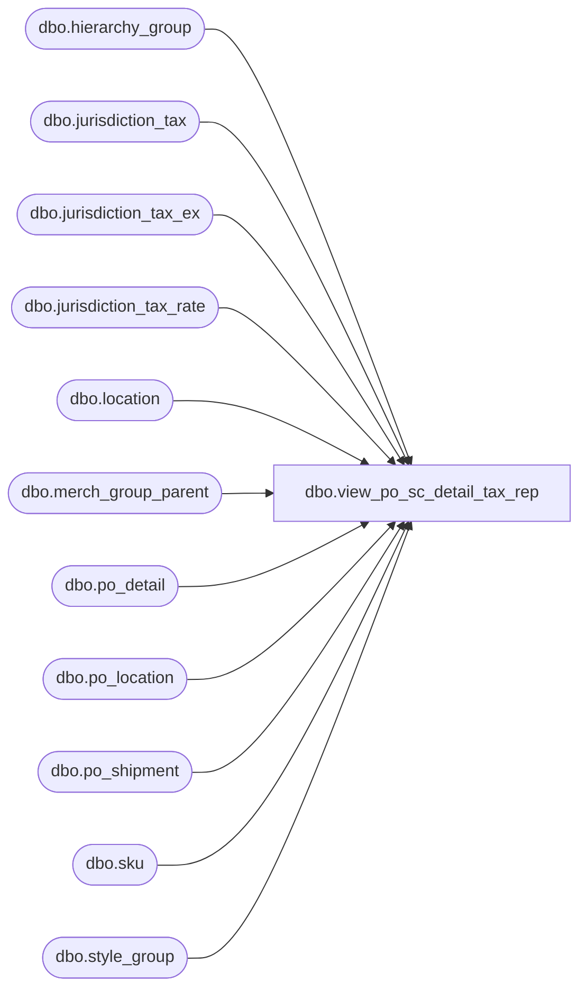

# dbo.view_po_sc_detail_tax_rep

**Database:** me_01  
**Server:** bedrockdb02  

## Architecture Diagram



## Table Dependencies

| Referenced Table |
|---|
| dbo.hierarchy_group |
| dbo.jurisdiction_tax |
| dbo.jurisdiction_tax_ex |
| dbo.jurisdiction_tax_rate |
| dbo.location |
| dbo.merch_group_parent |
| dbo.po_detail |
| dbo.po_location |
| dbo.po_shipment |
| dbo.sku |
| dbo.style_group |

## View Code

```sql
create view dbo.view_po_sc_detail_tax_rep 


AS
SELECT	jt.po_id,    
		jt.po_detail_id,
		1 / (1 + (SUM(COALESCE(ze.tax_rate, se.tax_rate, ge.tax_rate, jt.tax_rate, 0)) / 100)) AS total_exclude_tax_ratio
FROM   (SELECT 	pd.po_id,
				pd.po_detail_id,
				jt.tax_type_id, 
				jtr.tax_rate
		FROM	po_detail pd
				INNER JOIN po_location ploc    
				ON (pd.po_location_id = ploc.po_location_id    
					AND pd.po_id = ploc.po_id)    
				INNER JOIN (SELECT	po_id,
									po_shipment_id,
									CASE 
									WHEN expected_receipt_date > GETDATE()
									THEN expected_receipt_date 
									ELSE CONVERT(SMALLDATETIME, FLOOR(CONVERT(FLOAT, GETDATE())))
									END AS tax_date          
							FROM   po_shipment) ps    
				ON (pd.po_shipment_id = ps.po_shipment_id    
					AND pd.po_id = ps.po_id)    
				INNER JOIN location l    
				ON (ploc.location_id = l.location_id)    
				LEFT OUTER JOIN jurisdiction_tax jt    
				ON (jt.jurisdiction_id = l.jurisdiction_id
					AND jt.tax_inclusive_flag = 1
					AND jt.default_flag = 1)
				LEFT OUTER JOIN (jurisdiction_tax_rate jtr    
								INNER JOIN (SELECT jurisdiction_tax_id, MIN(effective_from_date) min_date    
											FROM jurisdiction_tax_rate    
											GROUP BY jurisdiction_tax_id) jtrm    
								ON (jtr.jurisdiction_tax_id = jtrm.jurisdiction_tax_id))    
				ON (jtr.jurisdiction_tax_id = jt.jurisdiction_tax_id    
					AND (CASE    
						WHEN ps.tax_date < jtrm.min_date    
						THEN jtrm.min_date    
						ELSE ps.tax_date    
						END) >= jtr.effective_from_date    
					AND (ps.tax_date <= jtr.effective_to_date OR jtr.effective_to_date IS NULL))
		WHERE	pd.pack_id IS NULL	
		)jt
		LEFT OUTER JOIN
  	   (SELECT pd.po_id,
				pd.po_detail_id,
				jt.tax_type_id, 
				jtr.tax_rate
		FROM	po_detail pd
				INNER JOIN sku
				ON (pd.sku_id = sku.sku_id)    
				INNER JOIN po_location ploc    
				ON (pd.po_location_id = ploc.po_location_id    
					AND pd.po_id = ploc.po_id)    
				INNER JOIN (SELECT	po_id,
									po_shipment_id,
									CASE 
									WHEN expected_receipt_date > GETDATE()
									THEN expected_receipt_date 
									ELSE CONVERT(SMALLDATETIME, FLOOR(CONVERT(FLOAT, GETDATE())))
									END AS tax_date          
							FROM   po_shipment) ps    
				ON (pd.po_shipment_id = ps.po_shipment_id    
					AND pd.po_id = ps.po_id)    
				INNER JOIN location l    
				ON (ploc.location_id = l.location_id)    
				INNER JOIN jurisdiction_tax_ex jte
				ON (sku.style_id = jte.style_id
					AND jte.jurisdiction_id = l.jurisdiction_id)
				INNER JOIN jurisdiction_tax jt
				ON (jt.jurisdiction_tax_id = jte.jurisdiction_tax_id
					AND jt.tax_inclusive_flag = 1)
				INNER JOIN (jurisdiction_tax_rate jtr    
							INNER JOIN (SELECT jurisdiction_tax_id, MIN(effective_from_date) min_date    
										FROM jurisdiction_tax_rate    
										GROUP BY jurisdiction_tax_id) jtrm    
							ON (jtr.jurisdiction_tax_id = jtrm.jurisdiction_tax_id))    
				ON (jtr.jurisdiction_tax_id = jt.jurisdiction_tax_id    
					AND (CASE    
						WHEN ps.tax_date < jtrm.min_date    
						THEN jtrm.min_date    
						ELSE ps.tax_date    
						END) >= jtr.effective_from_date    
					AND (ps.tax_date <= jtr.effective_to_date OR jtr.effective_to_date IS NULL))
		WHERE	pd.pack_id IS NULL	
		) se
		ON (jt.po_id = se.po_id
			AND jt.po_detail_id = se.po_detail_id
			AND jt.tax_type_id = se.tax_type_id)
		LEFT OUTER JOIN
	   (SELECT 	pd.po_id,
				pd.po_detail_id,
				jt.tax_type_id, 
				jtr.tax_rate
		FROM	po_detail pd
				INNER JOIN sku
				ON (pd.sku_id = sku.sku_id)    
				INNER JOIN po_location ploc    
				ON (pd.po_location_id = ploc.po_location_id    
					AND pd.po_id = ploc.po_id)    
				INNER JOIN (SELECT	po_id,
									po_shipment_id,
									CASE 
									WHEN expected_receipt_date > GETDATE()
									THEN expected_receipt_date 
									ELSE CONVERT(SMALLDATETIME, FLOOR(CONVERT(FLOAT, GETDATE())))
									END AS tax_date          
							FROM   po_shipment) ps    
				ON (pd.po_shipment_id = ps.po_shipment_id    
					AND pd.po_id = ps.po_id)    
				INNER JOIN location l    
				ON (ploc.location_id = l.location_id)    
				INNER JOIN jurisdiction_tax_ex jte
				ON (sku.style_size_id = jte.style_size_id
					AND jte.jurisdiction_id = l.jurisdiction_id)
				INNER JOIN jurisdiction_tax jt
				ON (jt.jurisdiction_tax_id = jte.jurisdiction_tax_id
					AND jt.tax_inclusive_flag = 1)
				INNER JOIN (jurisdiction_tax_rate jtr    
							INNER JOIN (SELECT jurisdiction_tax_id, MIN(effective_from_date) min_date    
										FROM jurisdiction_tax_rate    
										GROUP BY jurisdiction_tax_id) jtrm    
							ON (jtr.jurisdiction_tax_id = jtrm.jurisdiction_tax_id))    
				ON (jtr.jurisdiction_tax_id = jt.jurisdiction_tax_id    
					AND (CASE    
						WHEN ps.tax_date < jtrm.min_date    
						THEN jtrm.min_date    
						ELSE ps.tax_date    
						END) >= jtr.effective_from_date    
					AND (ps.tax_date <= jtr.effective_to_date OR jtr.effective_to_date IS NULL))
		WHERE	pd.pack_id IS NULL	
		) ze
		ON (jt.po_id = ze.po_id
			AND jt.po_detail_id = ze.po_detail_id
			AND jt.tax_type_id = ze.tax_type_id)
		LEFT OUTER JOIN
  	   (SELECT 	pd.po_id,
				pd.po_detail_id,
				jt.tax_type_id, 
				jtr.tax_rate
		FROM	po_detail pd
				INNER JOIN sku
				ON (pd.sku_id = sku.sku_id)    
				INNER JOIN style_group sg
				ON (sku.style_id = sg.style_id)
				INNER JOIN merch_group_parent mgp
				ON (sg.hierarchy_group_id = mgp.hierarchy_group_id)
				INNER JOIN hierarchy_group hg
				ON (mgp.parent_hierarchy_group_id = hg.hierarchy_group_id)
				INNER JOIN po_location ploc    
				ON (pd.po_location_id = ploc.po_location_id    
					AND pd.po_id = ploc.po_id)    
				INNER JOIN (SELECT	po_id,
									po_shipment_id,
									CASE 
									WHEN expected_receipt_date > GETDATE()
									THEN expected_receipt_date 
									ELSE CONVERT(SMALLDATETIME, FLOOR(CONVERT(FLOAT, GETDATE())))
									END AS tax_date          
							FROM   po_shipment) ps    
				ON (pd.po_shipment_id = ps.po_shipment_id    
					AND pd.po_id = ps.po_id)    
				INNER JOIN location l    
				ON (ploc.location_id = l.location_id)    
				INNER JOIN jurisdiction_tax_ex jte
				ON (jte.hierarchy_group_id = mgp.parent_hierarchy_group_id
					AND jte.jurisdiction_id = l.jurisdiction_id)
				INNER JOIN jurisdiction_tax jt
				ON (jt.jurisdiction_tax_id = jte.jurisdiction_tax_id
					AND jt.tax_inclusive_flag = 1)
				INNER JOIN (SELECT	pd.po_id,
									pd.po_detail_id,
									jt.tax_type_id, 
									max(hierarchy_level_id) as max_hierarchy_level_id
							FROM 	po_detail pd
									INNER JOIN sku
									ON (pd.sku_id = sku.sku_id)
									INNER JOIN style_group sg
									ON (sku.style_id = sg.style_id)
									INNER JOIN merch_group_parent mgp
									ON (sg.hierarchy_group_id = mgp.hierarchy_group_id)
									INNER JOIN po_location ploc    
									ON (pd.po_location_id = ploc.po_location_id    
										AND pd.po_id = ploc.po_id)    
									INNER JOIN location l    
									ON (ploc.location_id = l.location_id)    
									INNER JOIN (SELECT	po_id,
														po_shipment_id,
														CASE 
														WHEN expected_receipt_date > GETDATE()
														THEN expected_receipt_date 
														ELSE CONVERT(SMALLDATETIME, FLOOR(CONVERT(FLOAT, GETDATE())))
														END AS tax_date          
												FROM   po_shipment) ps    
									ON (pd.po_shipment_id = ps.po_shipment_id    
										AND pd.po_id = ps.po_id)    
									INNER JOIN jurisdiction_tax_ex jte
									ON (jte.hierarchy_group_id = mgp.parent_hierarchy_group_id
										AND jte.jurisdiction_id = l.jurisdiction_id)
									INNER JOIN jurisdiction_tax jt
									ON (jte.jurisdiction_tax_id = jt.jurisdiction_tax_id
										AND jt.tax_inclusive_flag = 1)
									INNER JOIN (jurisdiction_tax_rate jtr    
													INNER JOIN (SELECT jurisdiction_tax_id, MIN(effective_from_date) min_date    
																FROM jurisdiction_tax_rate    
																GROUP BY jurisdiction_tax_id) jtrm    
													ON (jtr.jurisdiction_tax_id = jtrm.jurisdiction_tax_id))    
									ON (jtr.jurisdiction_tax_id = jt.jurisdiction_tax_id    
										AND (CASE    
											WHEN ps.tax_date < jtrm.min_date    
											THEN jtrm.min_date    
											ELSE ps.tax_date    
											END) >= jtr.effective_from_date    
										AND (ps.tax_date <= jtr.effective_to_date OR jtr.effective_to_date IS NULL))
							GROUP BY pd.po_id,
									pd.po_detail_id,
									jt.tax_type_id) grmax
				ON (pd.po_id = grmax.po_id
					AND	pd.po_detail_id = grmax.po_detail_id
					AND jt.tax_type_id = grmax.tax_type_id
					AND hg.hierarchy_level_id = grmax.max_hierarchy_level_id)
				INNER JOIN (jurisdiction_tax_rate jtr    
								INNER JOIN (SELECT jurisdiction_tax_id, MIN(effective_from_date) min_date    
											FROM jurisdiction_tax_rate    
											GROUP BY jurisdiction_tax_id) jtrm    
								ON (jtr.jurisdiction_tax_id = jtrm.jurisdiction_tax_id))    
				ON (jtr.jurisdiction_tax_id = jt.jurisdiction_tax_id    
					AND (CASE    
						WHEN ps.tax_date < jtrm.min_date    
						THEN jtrm.min_date    
						ELSE ps.tax_date    
						END) >= jtr.effective_from_date    
					AND (ps.tax_date <= jtr.effective_to_date OR jtr.effective_to_date IS NULL))
		WHERE	pd.pack_id IS NULL	
		) ge
		ON (jt.po_id = ge.po_id
			AND jt.po_detail_id = ge.po_detail_id
			AND jt.tax_type_id = ge.tax_type_id)
GROUP BY jt.po_id,    
		jt.po_detail_id
```

