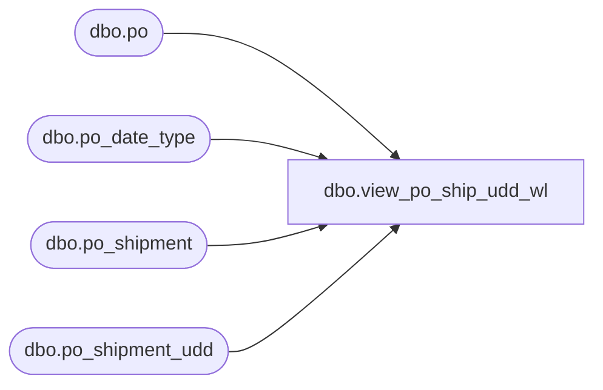

# dbo.view_po_ship_udd_wl

**Database:** me_01  
**Server:** bedrockdb02  

## Architecture Diagram



## Table Dependencies

| Referenced Table |
|---|
| dbo.po |
| dbo.po_date_type |
| dbo.po_shipment |
| dbo.po_shipment_udd |

## View Code

```sql
CREATE VIEW dbo.view_po_ship_udd_wl 
AS
SELECT 	DISTINCT
	po.po_id,
	ps.po_shipment_id,
	psu.user_defined_date,
	pdt.po_date_type_id, 
	pdt.date_type_code, 
	pdt.description AS date_type_desc
FROM	po
INNER JOIN po_shipment ps ON po.po_id = ps.po_id
LEFT OUTER JOIN po_shipment_udd psu ON (po.po_id = psu.po_id AND psu.po_shipment_id = ps.po_shipment_id)
LEFT OUTER JOIN po_date_type pdt ON (psu.po_date_type_id = pdt.po_date_type_id)
```

