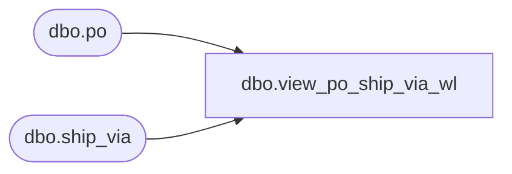

# dbo.view_po_ship_via_wl

**Database:** me_01  
**Server:** bedrockdb02  

## Architecture Diagram



## Table Dependencies

| Referenced Table |
|---|
| dbo.po |
| dbo.ship_via |

## View Code

```sql
create view dbo.view_po_ship_via_wl 
AS
SELECT 	DISTINCT
	po.po_id,
	sv.ship_via_id,
	sv.ship_via_code,
	sv.ship_via_description 
FROM	po
LEFT OUTER JOIN ship_via sv ON (po.ship_via_id = sv.ship_via_id)
```

