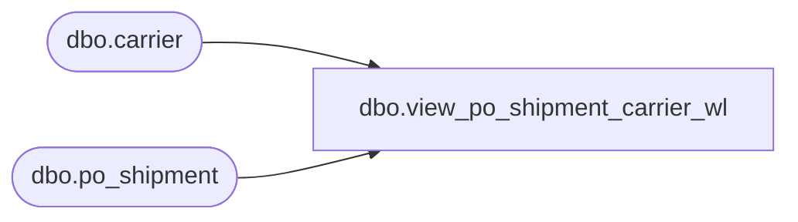

# dbo.view_po_shipment_carrier_wl

**Database:** me_01  
**Server:** bedrockdb02  

## Architecture Diagram



## Table Dependencies

| Referenced Table |
|---|
| dbo.carrier |
| dbo.po_shipment |

## View Code

```sql
CREATE view [dbo].[view_po_shipment_carrier_wl]

AS
SELECT DISTINCT ps.po_id, ps.po_shipment_id, ca.carrier_id, ca.carrier_code, ca.carrier_name
FROM po_shipment ps
LEFT OUTER JOIN carrier ca on ca.carrier_id = ps.carrier_id
```

