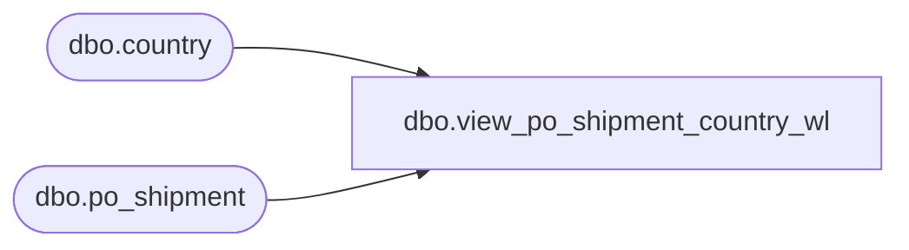

# dbo.view_po_shipment_country_wl

**Database:** me_01  
**Server:** bedrockdb02  

## Architecture Diagram



## Table Dependencies

| Referenced Table |
|---|
| dbo.country |
| dbo.po_shipment |

## View Code

```sql
CREATE view [dbo].[view_po_shipment_country_wl]

AS
SELECT DISTINCT ps.po_id, ps.po_shipment_id, c.country_id, c.country_code, c.country_description
FROM po_shipment ps
LEFT OUTER JOIN country c on c.country_id = ps.country_id
```

