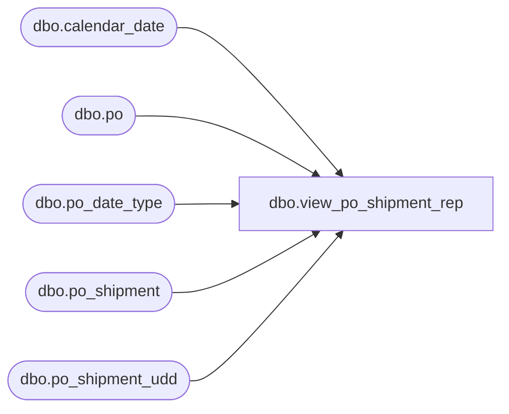

# dbo.view_po_shipment_rep

**Database:** me_01  
**Server:** bedrockdb02  

## Architecture Diagram



## Table Dependencies

| Referenced Table |
|---|
| dbo.calendar_date |
| dbo.po |
| dbo.po_date_type |
| dbo.po_shipment |
| dbo.po_shipment_udd |

## View Code

```sql
create view dbo.view_po_shipment_rep 

AS
SELECT 	DISTINCT
	po.po_id,
	ps.po_shipment_id,
	ps.expected_receipt_date,
	c.merch_year receipt_date_year,
	c.merch_period receipt_date_pariod,
	c.merch_week receipt_date_week,
	ps.estimated_shipment_percent,
	psu.user_defined_date,
	pdt.po_date_type_id, 
	pdt.date_type_code, 
	pdt.description 
FROM	po
LEFT OUTER JOIN po_shipment ps ON (po.po_id = ps.po_id)
LEFT OUTER JOIN po_shipment_udd psu ON (ps.po_id = psu.po_id AND ps.po_shipment_id = psu.po_shipment_id)
LEFT OUTER JOIN po_date_type pdt ON (psu.po_date_type_id = pdt.po_date_type_id)
LEFT OUTER JOIN calendar_date c ON (CONVERT(SMALLDATETIME, FLOOR(CONVERT(FLOAT, ps.expected_receipt_date))) = c.calendar_date)
```

