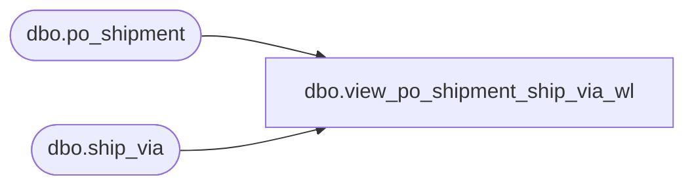

# dbo.view_po_shipment_ship_via_wl

**Database:** me_01  
**Server:** bedrockdb02  

## Architecture Diagram



## Table Dependencies

| Referenced Table |
|---|
| dbo.po_shipment |
| dbo.ship_via |

## View Code

```sql
CREATE view [dbo].[view_po_shipment_ship_via_wl]

AS
SELECT DISTINCT ps.po_id, ps.po_shipment_id, sh.ship_via_id, sh.ship_via_code, sh.ship_via_description
FROM po_shipment ps
LEFT OUTER JOIN ship_via sh on sh.ship_via_id = ps.ship_via_id
```

