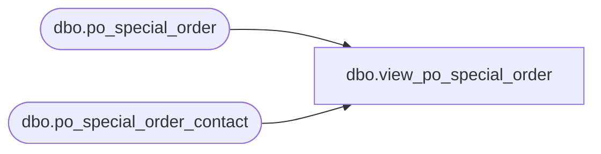

# dbo.view_po_special_order

**Database:** me_01  
**Server:** bedrockdb02  

## Architecture Diagram



## Table Dependencies

| Referenced Table |
|---|
| dbo.po_special_order |
| dbo.po_special_order_contact |

## View Code

```sql
create view dbo.view_po_special_order 

AS
SELECT DISTINCT	e.po_id,   
		b.po_special_order_id,         
		e.so_number,  
		e.customer_name,
		e.address1,
		e.address2,
		e.city,
		e.state,
		e.country_id,
		e.zip_code,
		e.member_number,   
		e.sa_number,
		e.sa_name,
		b.contact_type,
		b.description1,
		b.description2,
		b.contact_number                          
     FROM dbo.po_special_order e
     LEFT OUTER JOIN dbo.po_special_order_contact b
       ON (e.po_special_order_id = b.po_special_order_id
           and e.po_id = b.po_id)
```

